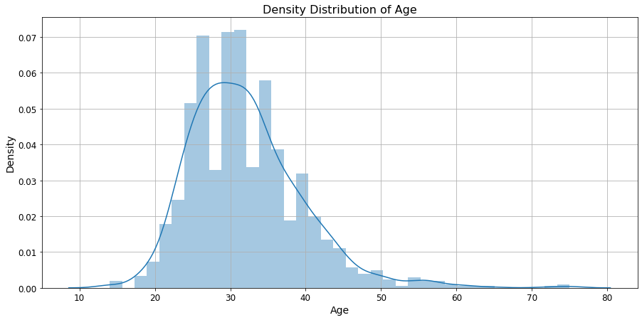
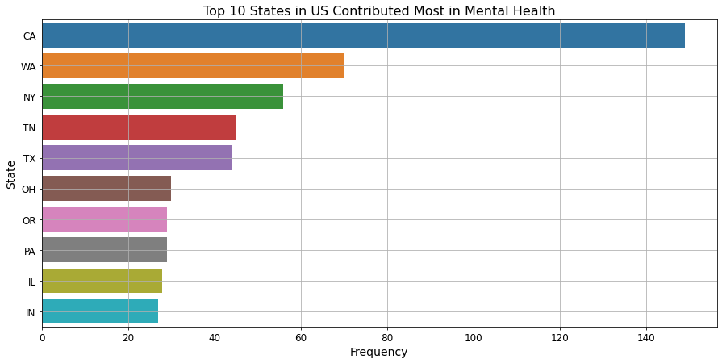

# Mental Health Case Study


```python
'''
EDA - 9 steps
1. Intro
2. prob
3. import
4. data
5. pre profiling
6. pre-processing
7. trust but verify
8. EDA - asking 15+-5 - relevant, reasonable, non-vague, UNI BI MULTI
9. Summary/Conclude - Actionable

'''
```

---
# **Table of Contents**
---

**1.** [**Introduction**](#Section1)<br>
**2.** [**Problem Statement**](#Section2)<br>
**3.** [**Installing & Importing Libraries**](#Section3)<br>
  - **3.1** [**Installing Libraries**](#Section31)
  - **3.2** [**Upgrading Libraries**](#Section32)
  - **3.3** [**Importing Libraries**](#Section33)

**4.** [**Data Acquisition & Description**](#Section4)<br>
  - **4.1** [**Data Description**](#Section41)
  - **4.2** [**Data Information**](#Section42)

**5.** [**Data Pre-processing**](#Section5)<br>
  - **5.1** [**Handling of Missing Data**](#Section51)
  - **5.2** [**Handling of Redundant Data**](#Section52)
  - **5.3** [**Handling of Inconsistent Data**](#Section53)
  - **5.4** [**Handling of Outliers**](#Section54)

**6.** [**Exploratory Data Analysis**](#Section6)<br>
  - **6.1** [**How does age relate to various behaviors and/or their awareness of their employer's attitude toward mental health?**](#Section61)
  - **6.2** [**What is the density distribution of Age feature?**](#Section62)
  - **6.3** [**What is the association between treatment and gender in terms of ratio?**](#Section63)
  - **6.4** [**What is the association between treatment and work interference in terms of ratio?**](#Section64)
  - **6.5** [**What is the association between treatment and age?**](#Section65)
  - **6.6** [**What is the association between treatment and family history of the employee?**](#Section66)
  - **6.7** [**What is the association between treatment and employee count in a company?**](#Section67)
  - **6.8** [**Which countries in common have contributed the most in terms of mental health?**](#Section68)
  - **6.9** [**Which states contributed the most in the US in terms of mental health?**](#Section69)
  - **6.10** [**What is the contribution of top 3 countries among all in terms of mental health?**](#Section610)
  - **6.11** [**What is the frequency distribution of work interference among employees for the top 3 countries?**](#Section611)
  - **6.12** [**What is the total number of employees going for treatment from the top 3 countries?**](#Section612)
  - **6.13** [**How many people did go for treatment based on gender for the top 3 countries?**](#Section613)
  - **6.14** [**What is the relationship between mental health consequences and the attitude?**](#Section614)

**7.** [**Summarization**](#Section7)<br>

---
<a name = Section1></a>
# **1. Introduction**
---

- For many of us, **work** is a **major part** of our **lives** where we spend much of our time to **make income** and **friends**. 

- Having a **fulfilling job** can be **good** for your **mental health** and general wellbeing.


- Mental health is the way we **think** and **feel** and our ability to **deal** with **ups and downs** and it is something we all have. 

- When we enjoy good mental health, we have a **sense of purpose** and **direction**, the energy to do the things we want to do.

- If you enjoy good mental health, you can:
  - make the most of your potential

  - cope with what life throws at you
  
  - play a full part in your relationships, your workplace, and your community.

- Your **mental health always fluctuates** as circumstances change as you move through different stages in your life.

- **Distress** is a word used to describe times when a **person isn’t coping** – for whatever reason. 

- It could be something at home, the pressure of work, or the start of a mental health problem like depression. 

- When we feel distressed, we **need a compassionate**, human response.

---
<a name = Section2></a>
# **2. Problem Statement**
---

- We all have times when we feel down, stressed or frightened. 

- Most of the time those feelings pass, but **sometimes** they develop into a mental health problem like **anxiety** or **depression**.

- It **impacts our daily lives** but for some people, mental health problems become complex and **require support** and **treatment** for life.

- Factors like poverty, childhood trauma, discrimination, etc. make it more likely that we will develop mental health problems.

- Different mental health problems **affect** people **in different ways** and it’s **key** to **understand** an **individual’s experience**. 


**<h4>Scenario</h4>**

- <a href="https://osmihelp.org/">**OSMI**</a>, an organization is working to **help people** to **identify** and **overcome mental health disorders** while working in a tech space.

- They **perform surveys** to **measure attitudes** towards mental health in the tech workplace.

- They **create detailed guides** on how to make the **workplace safe** and **supportive** for mentally stressed people.

- Using these surveys they **examine** the **frequency** of **mental health disorders** among tech workers.

- Also, they help workspaces to **identify** the **best resources** to **support** their **employees**.

- Checkout <a href="https://www.youtube.com/watch?v=NHulgcO_16U&list=PL1MEC8mwrpaIdzYKRidvNB5eYSwWrqFZ3">**Talks at Google**</a> to get better clarity about Mental Health in the Tech Industry.


<a name = Section33></a>
### **3.3 Importing Libraries**


```python
#-------------------------------------------------------------------------------------------------------------------------------
import pandas as pd                                                 # Importing for panel data analysis
pd.set_option('display.max_columns', None)                          # Unfolding hidden features if the cardinality is high
pd.set_option('display.max_colwidth', None)                         # Unfolding the max feature width for better clearity
pd.set_option('display.max_rows', None)                             # Unfolding hidden data points if the cardinality is high
pd.set_option('mode.chained_assignment', None)                      # Removing restriction over chained assignments operations
pd.set_option('display.float_format', lambda x: '%.5f' % x)         # To suppress scientific notation over exponential values
#-------------------------------------------------------------------------------------------------------------------------------
from collections import Counter                                     # For counting hashable objects
#-------------------------------------------------------------------------------------------------------------------------------
import matplotlib.pyplot as plt                                     # Importing pyplot interface using matplotlib
import seaborn as sns                                               # Importin seaborm library for interactive visualization
%matplotlib inline
#-------------------------------------------------------------------------------------------------------------------------------
import warnings                                                     # Importing warning to disable runtime warnings
warnings.filterwarnings("ignore")                                   # Warnings will appear only once
```

---
<a name = Section4></a>
# **4. Data Acquisition & Description**
---

- This dataset is obtained from a survey in 2014.

- It describes the attitudes towards mental health and frequency of mental health disorders in the tech workplace.

| Records | Features | Dataset Size |
| :-- | :-- | :-- |
| 1259 | 27 | 296 KB| 


| Id | Features | Description |
| :-- | :--| :--| 
|01|**Timestamp**|Time the survey was submitted.|
|02|**Age**|The age of the person.| 
|03|**Gender**|The gender of the person.|
|04|**Country**|The country name where person belongs to.|
|05|**state**|The state name where person belongs to.|
|06|**self_employed**|Is the person self employed or not.|
|07|**family_history**|Does the person's family history had mental illness or not?|
|08|**treatment**|Have you sought treatment for a mental health condition?|
|09|**work_intefere**|If you have a mental health condition, do you feel that it interferes with your work?|
|10|**no_employees**|How many employees does your company or organization have?|
|11|**remote_work**|Do you work remotely (outside of an office) at least 50% of the time?|
|12|**tech_company**|Is your employer primarily a tech company/organization?|
|13|**benifits**|Does your employer provide mental health benefits?|
|14|**care_options**|Do you know the options for mental health care your employer provides?|
|15|**wellness_program**|Has your employer ever discussed mental health as part of an employee wellness program?|
|16|**seek_help**|Does your employer provide resources to learn more about mental health issues and how to seek help?|
|17|**anonymity**|Is your anonymity protected if you choose to take advantage of mental health or substance abuse treatment resources?|
|18|**leave**|How easy is it for you to take medical leave for a mental health condition?|
|19|**mental_health_consequence**|Do you think that discussing a mental health issue with your employer would have negative consequences?|
|20|**phy_health_consequence**|Do you think that discussing a physical health issue with your employer would have negative consequences?|
|21|**coworkers**|Would you be willing to discuss a mental health issue with your coworkers?|
|22|**supervisor**|Would you be willing to discuss a mental health issue with your direct supervisor(s)?|
|23|**mental_health_interview**|Would you bring up a mental health issue with a potential employer in an interview?|
|24|**phs_health_interivew**|Would you bring up a physical health issue with a potential employer in an interview?|
|25|**mental_vs_physical**|Do you feel that your employer takes mental health as seriously as physical health?|
|26|**obs_consequence**|Have you heard of or observed negative consequences for coworkers with mental health conditions in your workplace?|
|27|**comments**|Any additional notes or comments.|

### Source of Data


```python
data = pd.read_csv(filepath_or_buffer='https://raw.githubusercontent.com/insaid2018/Term-1/master/Data/Casestudy/survey.csv')
print('Data Shape:', data.shape)
data.head()
```

    Data Shape: (1259, 27)
    


<div>
<style scoped>
    .dataframe tbody tr th:only-of-type {
        vertical-align: middle;
    }

    .dataframe tbody tr th {
        vertical-align: top;
    }

    .dataframe thead th {
        text-align: right;
    }
</style>
<table border="1" class="dataframe">
  <thead>
    <tr style="text-align: right;">
      <th></th>
      <th>Timestamp</th>
      <th>Age</th>
      <th>Gender</th>
      <th>Country</th>
      <th>state</th>
      <th>self_employed</th>
      <th>family_history</th>
      <th>treatment</th>
      <th>work_interfere</th>
      <th>no_employees</th>
      <th>remote_work</th>
      <th>tech_company</th>
      <th>benefits</th>
      <th>care_options</th>
      <th>wellness_program</th>
      <th>seek_help</th>
      <th>anonymity</th>
      <th>leave</th>
      <th>mental_health_consequence</th>
      <th>phys_health_consequence</th>
      <th>coworkers</th>
      <th>supervisor</th>
      <th>mental_health_interview</th>
      <th>phys_health_interview</th>
      <th>mental_vs_physical</th>
      <th>obs_consequence</th>
      <th>comments</th>
    </tr>
  </thead>
  <tbody>
    <tr>
      <th>0</th>
      <td>2014-08-27 11:29:31</td>
      <td>37</td>
      <td>Female</td>
      <td>United States</td>
      <td>IL</td>
      <td>NaN</td>
      <td>No</td>
      <td>Yes</td>
      <td>Often</td>
      <td>6-25</td>
      <td>No</td>
      <td>Yes</td>
      <td>Yes</td>
      <td>Not sure</td>
      <td>No</td>
      <td>Yes</td>
      <td>Yes</td>
      <td>Somewhat easy</td>
      <td>No</td>
      <td>No</td>
      <td>Some of them</td>
      <td>Yes</td>
      <td>No</td>
      <td>Maybe</td>
      <td>Yes</td>
      <td>No</td>
      <td>NaN</td>
    </tr>
    <tr>
      <th>1</th>
      <td>2014-08-27 11:29:37</td>
      <td>44</td>
      <td>M</td>
      <td>United States</td>
      <td>IN</td>
      <td>NaN</td>
      <td>No</td>
      <td>No</td>
      <td>Rarely</td>
      <td>More than 1000</td>
      <td>No</td>
      <td>No</td>
      <td>Don't know</td>
      <td>No</td>
      <td>Don't know</td>
      <td>Don't know</td>
      <td>Don't know</td>
      <td>Don't know</td>
      <td>Maybe</td>
      <td>No</td>
      <td>No</td>
      <td>No</td>
      <td>No</td>
      <td>No</td>
      <td>Don't know</td>
      <td>No</td>
      <td>NaN</td>
    </tr>
    <tr>
      <th>2</th>
      <td>2014-08-27 11:29:44</td>
      <td>32</td>
      <td>Male</td>
      <td>Canada</td>
      <td>NaN</td>
      <td>NaN</td>
      <td>No</td>
      <td>No</td>
      <td>Rarely</td>
      <td>6-25</td>
      <td>No</td>
      <td>Yes</td>
      <td>No</td>
      <td>No</td>
      <td>No</td>
      <td>No</td>
      <td>Don't know</td>
      <td>Somewhat difficult</td>
      <td>No</td>
      <td>No</td>
      <td>Yes</td>
      <td>Yes</td>
      <td>Yes</td>
      <td>Yes</td>
      <td>No</td>
      <td>No</td>
      <td>NaN</td>
    </tr>
    <tr>
      <th>3</th>
      <td>2014-08-27 11:29:46</td>
      <td>31</td>
      <td>Male</td>
      <td>United Kingdom</td>
      <td>NaN</td>
      <td>NaN</td>
      <td>Yes</td>
      <td>Yes</td>
      <td>Often</td>
      <td>26-100</td>
      <td>No</td>
      <td>Yes</td>
      <td>No</td>
      <td>Yes</td>
      <td>No</td>
      <td>No</td>
      <td>No</td>
      <td>Somewhat difficult</td>
      <td>Yes</td>
      <td>Yes</td>
      <td>Some of them</td>
      <td>No</td>
      <td>Maybe</td>
      <td>Maybe</td>
      <td>No</td>
      <td>Yes</td>
      <td>NaN</td>
    </tr>
    <tr>
      <th>4</th>
      <td>2014-08-27 11:30:22</td>
      <td>31</td>
      <td>Male</td>
      <td>United States</td>
      <td>TX</td>
      <td>NaN</td>
      <td>No</td>
      <td>No</td>
      <td>Never</td>
      <td>100-500</td>
      <td>Yes</td>
      <td>Yes</td>
      <td>Yes</td>
      <td>No</td>
      <td>Don't know</td>
      <td>Don't know</td>
      <td>Don't know</td>
      <td>Don't know</td>
      <td>No</td>
      <td>No</td>
      <td>Some of them</td>
      <td>Yes</td>
      <td>Yes</td>
      <td>Yes</td>
      <td>Don't know</td>
      <td>No</td>
      <td>NaN</td>
    </tr>
  </tbody>
</table>
</div>


```python
data.info()
```

    <class 'pandas.core.frame.DataFrame'>
    RangeIndex: 1259 entries, 0 to 1258
    Data columns (total 27 columns):
     #   Column                     Non-Null Count  Dtype 
    ---  ------                     --------------  ----- 
     0   Timestamp                  1259 non-null   object
     1   Age                        1259 non-null   int64 
     2   Gender                     1259 non-null   object
     3   Country                    1259 non-null   object
     4   state                      744 non-null    object
     5   self_employed              1241 non-null   object
     6   family_history             1259 non-null   object
     7   treatment                  1259 non-null   object
     8   work_interfere             995 non-null    object
     9   no_employees               1259 non-null   object
     10  remote_work                1259 non-null   object
     11  tech_company               1259 non-null   object
     12  benefits                   1259 non-null   object
     13  care_options               1259 non-null   object
     14  wellness_program           1259 non-null   object
     15  seek_help                  1259 non-null   object
     16  anonymity                  1259 non-null   object
     17  leave                      1259 non-null   object
     18  mental_health_consequence  1259 non-null   object
     19  phys_health_consequence    1259 non-null   object
     20  coworkers                  1259 non-null   object
     21  supervisor                 1259 non-null   object
     22  mental_health_interview    1259 non-null   object
     23  phys_health_interview      1259 non-null   object
     24  mental_vs_physical         1259 non-null   object
     25  obs_consequence            1259 non-null   object
     26  comments                   164 non-null    object
    dtypes: int64(1), object(26)
    memory usage: 265.7+ KB
    


```python

```


```python
data.describe()
```


<div>
<style scoped>
    .dataframe tbody tr th:only-of-type {
        vertical-align: middle;
    }

    .dataframe tbody tr th {
        vertical-align: top;
    }

    .dataframe thead th {
        text-align: right;
    }
</style>
<table border="1" class="dataframe">
  <thead>
    <tr style="text-align: right;">
      <th></th>
      <th>Age</th>
    </tr>
  </thead>
  <tbody>
    <tr>
      <th>count</th>
      <td>1259.00000</td>
    </tr>
    <tr>
      <th>mean</th>
      <td>79428148.31136</td>
    </tr>
    <tr>
      <th>std</th>
      <td>2818299442.98195</td>
    </tr>
    <tr>
      <th>min</th>
      <td>-1726.00000</td>
    </tr>
    <tr>
      <th>25%</th>
      <td>27.00000</td>
    </tr>
    <tr>
      <th>50%</th>
      <td>31.00000</td>
    </tr>
    <tr>
      <th>75%</th>
      <td>36.00000</td>
    </tr>
    <tr>
      <th>max</th>
      <td>99999999999.00000</td>
    </tr>
  </tbody>
</table>
</div>


```python
data['Age'].value_counts().sort_index()
```


    -1726            1
    -29              1
    -1               1
     5               1
     8               1
     11              1
     18              7
     19              9
     20              6
     21             16
     22             21
     23             51
     24             46
     25             61
     26             75
     27             71
     28             68
     29             85
     30             63
     31             67
     32             82
     33             70
     34             65
     35             55
     36             37
     37             43
     38             39
     39             33
     40             33
     41             21
     42             20
     43             28
     44             11
     45             12
     46             12
     47              2
     48              6
     49              4
     50              6
     51              5
     53              1
     54              3
     55              3
     56              4
     57              3
     58              1
     60              2
     61              1
     62              1
     65              1
     72              1
     329             1
     99999999999     1
    Name: Age, dtype: int64


```python
data.nunique()
```


    Timestamp                    1246
    Age                            53
    Gender                         49
    Country                        48
    state                          45
    self_employed                   2
    family_history                  2
    treatment                       2
    work_interfere                  4
    no_employees                    6
    remote_work                     2
    tech_company                    2
    benefits                        3
    care_options                    3
    wellness_program                3
    seek_help                       3
    anonymity                       3
    leave                           5
    mental_health_consequence       3
    phys_health_consequence         3
    coworkers                       3
    supervisor                      3
    mental_health_interview         3
    phys_health_interview           3
    mental_vs_physical              3
    obs_consequence                 2
    comments                      160
    dtype: int64


```python
# 1. convert time stamp to datetime
data['Timestamp'] = pd.to_datetime(data['Timestamp'])
```


```python
data.info()
```

    <class 'pandas.core.frame.DataFrame'>
    RangeIndex: 1259 entries, 0 to 1258
    Data columns (total 27 columns):
     #   Column                     Non-Null Count  Dtype         
    ---  ------                     --------------  -----         
     0   Timestamp                  1259 non-null   datetime64[ns]
     1   Age                        1259 non-null   int64         
     2   Gender                     1259 non-null   object        
     3   Country                    1259 non-null   object        
     4   state                      744 non-null    object        
     5   self_employed              1241 non-null   object        
     6   family_history             1259 non-null   object        
     7   treatment                  1259 non-null   object        
     8   work_interfere             995 non-null    object        
     9   no_employees               1259 non-null   object        
     10  remote_work                1259 non-null   object        
     11  tech_company               1259 non-null   object        
     12  benefits                   1259 non-null   object        
     13  care_options               1259 non-null   object        
     14  wellness_program           1259 non-null   object        
     15  seek_help                  1259 non-null   object        
     16  anonymity                  1259 non-null   object        
     17  leave                      1259 non-null   object        
     18  mental_health_consequence  1259 non-null   object        
     19  phys_health_consequence    1259 non-null   object        
     20  coworkers                  1259 non-null   object        
     21  supervisor                 1259 non-null   object        
     22  mental_health_interview    1259 non-null   object        
     23  phys_health_interview      1259 non-null   object        
     24  mental_vs_physical         1259 non-null   object        
     25  obs_consequence            1259 non-null   object        
     26  comments                   164 non-null    object        
    dtypes: datetime64[ns](1), int64(1), object(25)
    memory usage: 265.7+ KB
    


```python
# 2. State has missing value - study - decide to impuite logically, by replaceing with copuntry name

data.groupby(by = ['Country'])['state'].count()

```


    Country
    Australia                   0
    Austria                     0
    Bahamas, The                1
    Belgium                     0
    Bosnia and Herzegovina      0
    Brazil                      0
    Bulgaria                    1
    Canada                      0
    China                       0
    Colombia                    0
    Costa Rica                  0
    Croatia                     0
    Czech Republic              0
    Denmark                     0
    Finland                     0
    France                      0
    Georgia                     0
    Germany                     0
    Greece                      0
    Hungary                     0
    India                       0
    Ireland                     0
    Israel                      1
    Italy                       0
    Japan                       0
    Latvia                      1
    Mexico                      0
    Moldova                     0
    Netherlands                 0
    New Zealand                 0
    Nigeria                     0
    Norway                      0
    Philippines                 0
    Poland                      0
    Portugal                    0
    Romania                     0
    Russia                      0
    Singapore                   0
    Slovenia                    0
    South Africa                0
    Spain                       0
    Sweden                      0
    Switzerland                 0
    Thailand                    0
    United Kingdom              0
    United States             740
    Uruguay                     0
    Zimbabwe                    0
    Name: state, dtype: int64


```python
data.groupby(by = ['Country'])['Country'].count() - data.groupby(by = ['Country'])['state'].count()
```


    Country
    Australia                  21
    Austria                     3
    Bahamas, The                0
    Belgium                     6
    Bosnia and Herzegovina      1
    Brazil                      6
    Bulgaria                    3
    Canada                     72
    China                       1
    Colombia                    2
    Costa Rica                  1
    Croatia                     2
    Czech Republic              1
    Denmark                     2
    Finland                     3
    France                     13
    Georgia                     1
    Germany                    45
    Greece                      2
    Hungary                     1
    India                      10
    Ireland                    27
    Israel                      4
    Italy                       7
    Japan                       1
    Latvia                      0
    Mexico                      3
    Moldova                     1
    Netherlands                27
    New Zealand                 8
    Nigeria                     1
    Norway                      1
    Philippines                 1
    Poland                      7
    Portugal                    2
    Romania                     1
    Russia                      3
    Singapore                   4
    Slovenia                    1
    South Africa                6
    Spain                       1
    Sweden                      7
    Switzerland                 7
    Thailand                    1
    United Kingdom            185
    United States              11
    Uruguay                     1
    Zimbabwe                    1
    dtype: int64


```python
data.loc[data['state'].isnull(),'state'] = data['Country']
```


```python
data['state']
```


    0                           IL
    1                           IN
    2                       Canada
    3               United Kingdom
    4                           TX
    5                           TN
    6                           MI
    7                       Canada
    8                           IL
    9                       Canada
    10                          OH
    11                    Bulgaria
    12                          CA
    13                          CT
    14                      Canada
    15                          IL
    16              United Kingdom
    17                          TN
    18                          MD
    19                      France
    20                          NY
    21                          NC
    22                          MA
    23                          IA
    24                          CA
    25                          TN
    26                          TN
    27                          CA
    28                          OH
    29              United Kingdom
    30              United Kingdom
    31                          PA
    32              United Kingdom
    33                          WA
    34                          WI
    35                          NY
    36                      Canada
    37                    Portugal
    38                          IN
    39                          TX
    40              United Kingdom
    41                          MI
    42                      Canada
    43                 Netherlands
    44                          IN
    45                          TX
    46              United Kingdom
    47                          TN
    48                      Canada
    49                          IL
    50                          TX
    51                          UT
    52               United States
    53                          TN
    54                 Switzerland
    55                          NY
    56                          TN
    57                          NY
    58                          TN
    59                      Canada
    60                          IA
    61                      Poland
    62              United Kingdom
    63                      France
    64                      Canada
    65                          CA
    66                   Australia
    67                          TX
    68                          NM
    69                          NY
    70                      France
    71                      Canada
    72                          MA
    73              United Kingdom
    74                          CA
    75              United Kingdom
    76                          WA
    77                          WA
    78                          UT
    79                     Germany
    80                          NY
    81              United Kingdom
    82                      Canada
    83                          NY
    84                          CA
    85                          TX
    86              United Kingdom
    87                          OR
    88                          FL
    89                          IL
    90                          NY
    91                          TX
    92                          OH
    93                      Russia
    94                      Canada
    95                          MN
    96                          MO
    97                      Mexico
    98                          AZ
    99                          IN
    100                     Canada
    101                         MA
    102                         NY
    103                         WI
    104                         NY
    105                         MO
    106                         OR
    107                     Brazil
    108                         TN
    109                         WA
    110                         NY
    111                         CA
    112                         MO
    113                         NY
    114                         TX
    115             United Kingdom
    116             United Kingdom
    117                     Canada
    118                         CT
    119                         CO
    120                         GA
    121                         DC
    122                         MN
    123                         WA
    124                     Canada
    125                         WA
    126             United Kingdom
    127                         OR
    128             United Kingdom
    129                   Slovenia
    130                         IL
    131                         CA
    132                         NE
    133                 Costa Rica
    134                     Canada
    135             United Kingdom
    136             United Kingdom
    137                         IA
    138                         MD
    139                    Austria
    140                         OR
    141             United Kingdom
    142                         TX
    143                         MN
    144                         PA
    145                         IN
    146             United Kingdom
    147                         WV
    148                    Ireland
    149                         MI
    150                     Canada
    151                         CA
    152                     Poland
    153                         IL
    154             United Kingdom
    155                         IL
    156                         CA
    157                         OK
    158                         UT
    159                         IL
    160             United Kingdom
    161                         NY
    162                         CA
    163                         MA
    164                         WA
    165             United Kingdom
    166                         MN
    167                         CA
    168                    Ireland
    169             United Kingdom
    170             United Kingdom
    171             United Kingdom
    172                      India
    173                         NC
    174                     Canada
    175                         MO
    176             United Kingdom
    177                         MA
    178                         CA
    179                         TX
    180                     Mexico
    181                      India
    182             United Kingdom
    183                         CA
    184                         WA
    185                         MA
    186             United Kingdom
    187                     France
    188             United Kingdom
    189                         CA
    190               South Africa
    191                         MI
    192                     Russia
    193                         CA
    194                    Germany
    195                      Italy
    196                         NY
    197                         CA
    198                         TN
    199             United Kingdom
    200                         OR
    201                         MN
    202                         FL
    203                    Ireland
    204                    Austria
    205             United Kingdom
    206                     Canada
    207                         MA
    208                         KS
    209                   Bulgaria
    210                         DC
    211             United Kingdom
    212             United Kingdom
    213                         TX
    214                         MA
    215                         MI
    216                    Germany
    217                     Canada
    218                         NY
    219                         VA
    220                         WA
    221             United Kingdom
    222                         PA
    223                         MI
    224                         PA
    225                         OR
    226                         WA
    227                  Australia
    228                         PA
    229             United Kingdom
    230                         OH
    231                         TX
    232             United Kingdom
    233                         NH
    234                Netherlands
    235             United Kingdom
    236                     Canada
    237             United Kingdom
    238                         NC
    239                     Canada
    240                     Sweden
    241                         FL
    242                         CA
    243               South Africa
    244                         GA
    245                         OH
    246                         KY
    247             United Kingdom
    248                         NC
    249                         NY
    250                         AL
    251                         GA
    252                         CA
    253             United Kingdom
    254                         VA
    255                     Canada
    256             United Kingdom
    257                         WA
    258             United Kingdom
    259                  Australia
    260                         TX
    261                     Canada
    262                         FL
    263                     Poland
    264                     Canada
    265                         NV
    266                         AL
    267             United Kingdom
    268                         CA
    269                         CO
    270                    Ireland
    271                         MN
    272                         NJ
    273             United Kingdom
    274                         PA
    275                     Canada
    276                         MO
    277                   Colombia
    278                         MN
    279                         PA
    280                  Australia
    281                   Portugal
    282                         TX
    283                         NY
    284                     Canada
    285             United Kingdom
    286                         WA
    287                         WA
    288                         TX
    289                         TX
    290                Switzerland
    291                         CA
    292                         NY
    293                         CA
    294              United States
    295                         CA
    296                         SC
    297                         CA
    298                         CA
    299                         NY
    300                         NY
    301                         CA
    302                         MA
    303                         WA
    304                         CA
    305                     Canada
    306                         IL
    307                         IN
    308                         OR
    309                         TN
    310                     Canada
    311                         OR
    312                         WA
    313                         CA
    314                         CA
    315                         VT
    316                         NY
    317                         UT
    318                         NY
    319                         NY
    320                         SD
    321                         CA
    322                         OR
    323                         CA
    324                         CA
    325                         CA
    326                         CO
    327                         CA
    328                         OH
    329                    Germany
    330                         WA
    331                     Canada
    332                         OH
    333                    Ireland
    334                    Romania
    335                         WA
    336             United Kingdom
    337                         CA
    338                         MA
    339                         WA
    340                         MI
    341                         WA
    342                         CA
    343                         IA
    344             United Kingdom
    345                         WA
    346                         AL
    347                         CA
    348                         CA
    349                         CA
    350                    Belgium
    351                         MA
    352             United Kingdom
    353                         CA
    354                     Sweden
    355                         CA
    356                         IN
    357                         WA
    358                         WA
    359                         IN
    360                         WA
    361                    Germany
    362                         OK
    363                         MI
    364                         OH
    365                         GA
    366                         CA
    367              United States
    368                         IN
    369             United Kingdom
    370                         WA
    371                         WA
    372                         PA
    373                         WA
    374                         CA
    375                         MA
    376                         WA
    377                         WA
    378                         NY
    379                         CA
    380                     Canada
    381                         CA
    382                         IN
    383                    Germany
    384                         NV
    385                         CO
    386                New Zealand
    387                         CA
    388                         CA
    389                     Sweden
    390                   Zimbabwe
    391                         PA
    392                         SC
    393                     Canada
    394                         TX
    395                         TX
    396             United Kingdom
    397             United Kingdom
    398                         AL
    399                     Canada
    400                         OR
    401                         NJ
    402                         CA
    403                         CA
    404                    Germany
    405                         CA
    406                         NH
    407                         CA
    408                     Brazil
    409                      Spain
    410                         OH
    411                         OH
    412                         MA
    413             United Kingdom
    414                         OK
    415                         CA
    416                    Germany
    417                      India
    418                    Finland
    419                         ID
    420                    Germany
    421                    Uruguay
    422                New Zealand
    423             United Kingdom
    424                         NY
    425                         CA
    426                         TX
    427                         MD
    428                         IN
    429                         OR
    430                     Canada
    431                         NY
    432                         MS
    433                         NJ
    434                         CA
    435                         TN
    436                         WA
    437                  Australia
    438                         MA
    439                         PA
    440             United Kingdom
    441                         KY
    442                         PA
    443                         MA
    444                     Canada
    445                         CA
    446                         VT
    447                         CA
    448                         AZ
    449                     Canada
    450                         MA
    451                         VA
    452                         WA
    453                         CA
    454                         OR
    455                         MI
    456                     Brazil
    457                Netherlands
    458             United Kingdom
    459                         OR
    460             United Kingdom
    461                         CA
    462                         UT
    463                         CA
    464                         TX
    465             United Kingdom
    466                         CA
    467             United Kingdom
    468                     France
    469                Netherlands
    470                         OR
    471                         CA
    472                         OH
    473             United Kingdom
    474                         OH
    475                         CA
    476                    Germany
    477                    Germany
    478                    Finland
    479                         NY
    480                         VA
    481                         CA
    482             United Kingdom
    483                         IL
    484                         TX
    485                    Germany
    486                         NY
    487                         CA
    488                         MD
    489                      Italy
    490                         CA
    491                         PA
    492                     Israel
    493                         CA
    494                         WA
    495                         NY
    496                         TX
    497                         CA
    498             United Kingdom
    499                Netherlands
    500                         AZ
    501                    Ireland
    502             United Kingdom
    503                    Germany
    504                         OH
    505                         CA
    506                         KS
    507             United Kingdom
    508                         CA
    509                         CA
    510                         NY
    511                         WA
    512                         CA
    513                         WA
    514                         VA
    515                         NC
    516                         OH
    517                         PA
    518                    Germany
    519             United Kingdom
    520                         CA
    521                         TX
    522                         AZ
    523     Bosnia and Herzegovina
    524                         IL
    525              United States
    526                    Austria
    527                New Zealand
    528                         NC
    529                     Canada
    530             United Kingdom
    531                  Australia
    532                    Hungary
    533                     Sweden
    534                     Canada
    535                  Australia
    536                         WI
    537                         CA
    538             United Kingdom
    539                         CA
    540                         MN
    541                         PA
    542             United Kingdom
    543                         CA
    544             United Kingdom
    545             United Kingdom
    546             United Kingdom
    547                         CA
    548                         CA
    549                    Germany
    550                         CA
    551                New Zealand
    552                     Canada
    553             United Kingdom
    554                New Zealand
    555                     Canada
    556                  Australia
    557                         NY
    558                Netherlands
    559                         CA
    560                         FL
    561                         OR
    562                  Australia
    563                         CO
    564                     Canada
    565                         GA
    566                         OR
    567                         CA
    568                         CA
    569                         PA
    570                         CA
    571                         CA
    572                         NY
    573                         MA
    574              United States
    575                         PA
    576                         RI
    577                         MI
    578                     Canada
    579                         IL
    580                         CA
    581                         OR
    582                     Canada
    583                         IN
    584                  Singapore
    585                         MA
    586                  Australia
    587                         MI
    588                         OH
    589                         OH
    590                         NH
    591                         OH
    592                     Canada
    593                         TN
    594                         OR
    595                         PA
    596              United States
    597                         NY
    598                         WA
    599                         NY
    600                         CA
    601                         TN
    602                         WI
    603                         WI
    604                         PA
    605                         MI
    606                         WY
    607                         KY
    608                         NY
    609                  Australia
    610                         TX
    611                         WI
    612                         WA
    613                  Singapore
    614                         WA
    615                         GA
    616                         MI
    617                         MD
    618                Netherlands
    619             United Kingdom
    620                    Germany
    621                Netherlands
    622                         WA
    623                         CA
    624                         OR
    625                         CA
    626                     Canada
    627                         CA
    628                     Canada
    629                         MI
    630             United Kingdom
    631                         MA
    632                    Germany
    633                         CA
    634                    Germany
    635                    Germany
    636                     Poland
    637             United Kingdom
    638              United States
    639                      Japan
    640                    Germany
    641                    Germany
    642                  Australia
    643                         CA
    644                    Belgium
    645                    Ireland
    646                    Ireland
    647                  Australia
    648                  Australia
    649                Netherlands
    650                         FL
    651             United Kingdom
    652             United Kingdom
    653                  Australia
    654                         WA
    655                    Nigeria
    656                     Poland
    657                    Germany
    658             United Kingdom
    659                    Germany
    660                Switzerland
    661             United Kingdom
    662                         CA
    663                    Ireland
    664                      Italy
    665                    Ireland
    666                      India
    667                    Ireland
    668                Netherlands
    669                     France
    670                     Russia
    671                         NC
    672                     Canada
    673                     Israel
    674                     Canada
    675                         IL
    676                      India
    677                         OH
    678                    Germany
    679                         VA
    680                   Bulgaria
    681                         MN
    682                         MO
    683                     Canada
    684             United Kingdom
    685                      India
    686                         NC
    687                         NY
    688                         NM
    689             United Kingdom
    690                     Canada
    691                Netherlands
    692                    Germany
    693                     Canada
    694             United Kingdom
    695             United Kingdom
    696                     France
    697                         TX
    698                     France
    699                         SC
    700                         FL
    701                         WA
    702                         CA
    703                         OH
    704                         TN
    705             United Kingdom
    706                         NY
    707                         NY
    708                         MO
    709                         NY
    710             United Kingdom
    711                     France
    712                         TN
    713                         CO
    714                         PA
    715             United Kingdom
    716                    Germany
    717                         NY
    718                Netherlands
    719                         MN
    720             United Kingdom
    721                     Canada
    722                     Canada
    723                         MO
    724                         WY
    725               South Africa
    726                    Germany
    727                Switzerland
    728                         MN
    729                    Croatia
    730             United Kingdom
    731                     France
    732                         MD
    733                         KY
    734                         OH
    735             United Kingdom
    736                         NY
    737             United Kingdom
    738             United Kingdom
    739                         TN
    740                  Australia
    741                    Belgium
    742             United Kingdom
    743                         TX
    744                         OH
    745                         TX
    746                     Canada
    747                      Italy
    748                         CA
    749                     Canada
    750                     Norway
    751                    Germany
    752                         MI
    753                   Thailand
    754                         CA
    755                         OR
    756                         NC
    757                         CA
    758                    Germany
    759                         IL
    760                     Canada
    761                         CA
    762                    Ireland
    763                    Ireland
    764                         CA
    765                Netherlands
    766                         AZ
    767             United Kingdom
    768                         CA
    769             United Kingdom
    770             United Kingdom
    771                         VA
    772             United Kingdom
    773             United Kingdom
    774             United Kingdom
    775                     Canada
    776                         VA
    777             United Kingdom
    778                         WA
    779             United Kingdom
    780             United Kingdom
    781                         WI
    782             United Kingdom
    783                         CA
    784                         CA
    785                         NE
    786             United Kingdom
    787                         CO
    788                Netherlands
    789                Switzerland
    790             United Kingdom
    791                         NY
    792                         TX
    793                         LA
    794                         WA
    795                         MI
    796                         CA
    797                     Brazil
    798                Switzerland
    799                         CA
    800                         MD
    801                         CA
    802                         CT
    803                         CA
    804             United Kingdom
    805                         CA
    806                         WA
    807                         CA
    808                         IN
    809                         TX
    810             United Kingdom
    811             United Kingdom
    812                         MO
    813                         NV
    814             United Kingdom
    815                         WA
    816                         FL
    817              United States
    818                    Germany
    819                    Denmark
    820                         WA
    821                    Denmark
    822                         IL
    823                         FL
    824                         MA
    825                         CA
    826                         WA
    827                         MI
    828             United Kingdom
    829                         MI
    830                         WI
    831                         CA
    832                     Sweden
    833                         CA
    834                         TX
    835             United Kingdom
    836                         NY
    837                         PA
    838             United Kingdom
    839                         PA
    840                         GA
    841             United Kingdom
    842                         NY
    843                         CA
    844                         TN
    845                      Italy
    846                         TN
    847                Netherlands
    848                         TN
    849                         IL
    850                         WI
    851                         KY
    852             United Kingdom
    853                     Canada
    854              United States
    855                         CA
    856                         MN
    857                         TN
    858                         MN
    859             United Kingdom
    860             United Kingdom
    861             United Kingdom
    862                         IL
    863                         TN
    864                         IL
    865             United Kingdom
    866                         DC
    867                         KS
    868                    Germany
    869                     Mexico
    870                         CA
    871             United Kingdom
    872             United Kingdom
    873                         TN
    874                         OK
    875                         CA
    876                         TN
    877                         TX
    878             United Kingdom
    879                         CO
    880                         TN
    881                         GA
    882                         TN
    883                         VA
    884                         TN
    885                         DC
    886             United Kingdom
    887             United Kingdom
    888                      India
    889                         TN
    890                         VA
    891                         TN
    892                         TN
    893                         TN
    894                         TN
    895                         TN
    896                         IN
    897                    Germany
    898                         VA
    899                         TX
    900                         TX
    901             United Kingdom
    902                         CA
    903             United Kingdom
    904                         CO
    905                         OR
    906                         OK
    907                         OH
    908                         TN
    909                         VA
    910                  Australia
    911                         OR
    912             United Kingdom
    913                         OR
    914                     Canada
    915             United Kingdom
    916                         PA
    917             United Kingdom
    918                         SC
    919                         CA
    920                         TN
    921                         UT
    922                         CA
    923                New Zealand
    924                         MO
    925                         CA
    926              United States
    927                         NY
    928                         TX
    929                         MO
    930                         GA
    931                         TX
    932                         WA
    933                         WA
    934                         WA
    935             United Kingdom
    936                         TX
    937                Netherlands
    938                         WA
    939                         WA
    940                         WA
    941                         WA
    942                         AZ
    943                         WA
    944                         WA
    945                         AZ
    946                         NY
    947                         WA
    948                         CA
    949                         WA
    950                Netherlands
    951             United Kingdom
    952               South Africa
    953                         WA
    954                         TN
    955                    Germany
    956                         WA
    957                Netherlands
    958                         CA
    959             United Kingdom
    960             United Kingdom
    961                    Germany
    962                    Germany
    963             United Kingdom
    964             United Kingdom
    965             United Kingdom
    966             United Kingdom
    967             United Kingdom
    968             United Kingdom
    969             United Kingdom
    970                         MI
    971             United Kingdom
    972                         IN
    973                         GA
    974                    Germany
    975                    Germany
    976                         WA
    977                     France
    978                    Belgium
    979             United Kingdom
    980                         ME
    981                     Canada
    982             United Kingdom
    983                         NY
    984                     Canada
    985             United Kingdom
    986             United Kingdom
    987             United Kingdom
    988                         PA
    989                         IL
    990             United Kingdom
    991             United Kingdom
    992                         IL
    993             United Kingdom
    994                      India
    995             United Kingdom
    996                         MN
    997                         TX
    998             United Kingdom
    999                     Sweden
    1000                        PA
    1001                        IN
    1002                        PA
    1003                        OH
    1004            United Kingdom
    1005            United Kingdom
    1006                        PA
    1007                        SD
    1008                        IN
    1009                        CA
    1010                        TN
    1011                        TX
    1012                        TN
    1013                        OR
    1014                        SD
    1015                    Israel
    1016                        NY
    1017                        CT
    1018                        CA
    1019             United States
    1020                    Canada
    1021                        GA
    1022                        TN
    1023            United Kingdom
    1024                        IN
    1025                        CA
    1026                        OR
    1027                        IN
    1028                        GA
    1029                        IN
    1030                        MN
    1031                        MN
    1032                        NC
    1033                        FL
    1034                        MN
    1035                    Canada
    1036                 Australia
    1037                        MO
    1038                        CA
    1039                        OR
    1040                        OH
    1041                        NY
    1042                        WI
    1043                        WA
    1044            United Kingdom
    1045                    Canada
    1046                     Italy
    1047                    Brazil
    1048                        IL
    1049            United Kingdom
    1050                        WA
    1051                        IL
    1052               Switzerland
    1053                        FL
    1054                        TN
    1055                        WA
    1056                        CA
    1057                        FL
    1058                    Canada
    1059                        OR
    1060                        NJ
    1061                        CA
    1062                        FL
    1063                        UT
    1064                   Germany
    1065              South Africa
    1066                        NJ
    1067                        PA
    1068                        IN
    1069                    Greece
    1070                        OH
    1071                        OH
    1072                        IL
    1073                        IN
    1074                        CA
    1075                        WA
    1076                        VA
    1077                        WA
    1078                        NJ
    1079               Netherlands
    1080                        UT
    1081               Netherlands
    1082                        TN
    1083                    Canada
    1084            United Kingdom
    1085                   Germany
    1086                   Germany
    1087                        IN
    1088                        IN
    1089                        CA
    1090                        OH
    1091                        TX
    1092                        TN
    1093                        WA
    1094                        UT
    1095                        AL
    1096                        WI
    1097                        WA
    1098                        WI
    1099                        NY
    1100                        NY
    1101                        OH
    1102                    Canada
    1103                        WA
    1104                        CA
    1105                        SC
    1106                    France
    1107                 Australia
    1108                        CA
    1109                     India
    1110                   Croatia
    1111                    France
    1112                   Germany
    1113                        MN
    1114                        WA
    1115                    Canada
    1116            United Kingdom
    1117                        PA
    1118                        NY
    1119                        VT
    1120            United Kingdom
    1121            United Kingdom
    1122            United Kingdom
    1123                        MI
    1124                        NY
    1125                   Germany
    1126                        NY
    1127                        AL
    1128               Netherlands
    1129                        MI
    1130                        WA
    1131            United Kingdom
    1132                        TN
    1133               New Zealand
    1134               New Zealand
    1135            United Kingdom
    1136            United Kingdom
    1137            United Kingdom
    1138                   Germany
    1139            United Kingdom
    1140                   Moldova
    1141                    Sweden
    1142                   Belgium
    1143            United Kingdom
    1144                    Israel
    1145                        NY
    1146            United Kingdom
    1147            United Kingdom
    1148                        IN
    1149                        NC
    1150                        CA
    1151            United Kingdom
    1152                    Canada
    1153            United Kingdom
    1154                        TN
    1155                    Canada
    1156               Netherlands
    1157            United Kingdom
    1158                        MN
    1159                 Singapore
    1160                        NC
    1161            United Kingdom
    1162                     India
    1163                        TX
    1164                        CA
    1165                        CA
    1166                        IL
    1167                    Poland
    1168                  Colombia
    1169                        PA
    1170                        IL
    1171                        IL
    1172                        MN
    1173            United Kingdom
    1174                   Georgia
    1175                        NY
    1176                        MI
    1177                        OH
    1178                     China
    1179                        UT
    1180                        NY
    1181                        CA
    1182                        IN
    1183                        IN
    1184                        VA
    1185                        OK
    1186                        OR
    1187                        AL
    1188                   Belgium
    1189                        AL
    1190                        OH
    1191                    Canada
    1192            United Kingdom
    1193                     Italy
    1194                   Germany
    1195                   Ireland
    1196                   Ireland
    1197                   Ireland
    1198                        TX
    1199                   Ireland
    1200                 Australia
    1201                        TX
    1202                    Brazil
    1203            United Kingdom
    1204                   Ireland
    1205                   Ireland
    1206            United Kingdom
    1207                        TX
    1208            Czech Republic
    1209                 Singapore
    1210                   Ireland
    1211                   Ireland
    1212            United Kingdom
    1213               Philippines
    1214                        FL
    1215               Netherlands
    1216            United Kingdom
    1217                   Ireland
    1218               Netherlands
    1219                        TX
    1220                        CA
    1221                        MD
    1222               Netherlands
    1223            United Kingdom
    1224                   Ireland
    1225                   Ireland
    1226               Netherlands
    1227                   Ireland
    1228                        MN
    1229                    Greece
    1230            United Kingdom
    1231            United Kingdom
    1232            United Kingdom
    1233            United Kingdom
    1234            United Kingdom
    1235                    Canada
    1236                        CA
    1237                   Ireland
    1238                        TN
    1239               Netherlands
    1240                   Germany
    1241                    Poland
    1242                   Ireland
    1243                        FL
    1244            United Kingdom
    1245                 Australia
    1246                        OR
    1247                   Finland
    1248                        WA
    1249                        CA
    1250                        CA
    1251              South Africa
    1252                        NC
    1253                        UT
    1254            United Kingdom
    1255                        IL
    1256                        CA
    1257                        NC
    1258                        IL
    Name: state, dtype: object


```python
import numpy as np
```


```python
# 3. self employed - missing - mode
# 4. work intefer - mode
# 5. comment - missing - drop it.
```


```python
data['self_employed'].value_counts().index[0]
```


    'No'


```python
data['self_employed'] = data['self_employed'].replace(np.nan, data['self_employed'].mode()[0])
data['work_interfere'] = data['work_interfere'].replace(np.nan, data['work_interfere'].mode()[0])
data.drop('comments', axis = 1, inplace = True)
```


```python
data.info()
```

    <class 'pandas.core.frame.DataFrame'>
    RangeIndex: 1259 entries, 0 to 1258
    Data columns (total 26 columns):
     #   Column                     Non-Null Count  Dtype         
    ---  ------                     --------------  -----         
     0   Timestamp                  1259 non-null   datetime64[ns]
     1   Age                        1259 non-null   int64         
     2   Gender                     1259 non-null   object        
     3   Country                    1259 non-null   object        
     4   state                      1259 non-null   object        
     5   self_employed              1259 non-null   object        
     6   family_history             1259 non-null   object        
     7   treatment                  1259 non-null   object        
     8   work_interfere             1259 non-null   object        
     9   no_employees               1259 non-null   object        
     10  remote_work                1259 non-null   object        
     11  tech_company               1259 non-null   object        
     12  benefits                   1259 non-null   object        
     13  care_options               1259 non-null   object        
     14  wellness_program           1259 non-null   object        
     15  seek_help                  1259 non-null   object        
     16  anonymity                  1259 non-null   object        
     17  leave                      1259 non-null   object        
     18  mental_health_consequence  1259 non-null   object        
     19  phys_health_consequence    1259 non-null   object        
     20  coworkers                  1259 non-null   object        
     21  supervisor                 1259 non-null   object        
     22  mental_health_interview    1259 non-null   object        
     23  phys_health_interview      1259 non-null   object        
     24  mental_vs_physical         1259 non-null   object        
     25  obs_consequence            1259 non-null   object        
    dtypes: datetime64[ns](1), int64(1), object(24)
    memory usage: 255.9+ KB
    


```python
#6. Age - wrong values, convert the data such that age>18 and <75, anything beyng should be changed.

```


```python
data = data[(data['Age']>=18) & (data['Age'] < 75)]
```


```python
data.info()
```

    <class 'pandas.core.frame.DataFrame'>
    Int64Index: 1244 entries, 0 to 1258
    Data columns (total 26 columns):
     #   Column                     Non-Null Count  Dtype         
    ---  ------                     --------------  -----         
     0   Timestamp                  1244 non-null   datetime64[ns]
     1   Age                        1244 non-null   int64         
     2   Gender                     1244 non-null   object        
     3   Country                    1244 non-null   object        
     4   state                      1244 non-null   object        
     5   self_employed              1244 non-null   object        
     6   family_history             1244 non-null   object        
     7   treatment                  1244 non-null   object        
     8   work_interfere             1244 non-null   object        
     9   no_employees               1244 non-null   object        
     10  remote_work                1244 non-null   object        
     11  tech_company               1244 non-null   object        
     12  benefits                   1244 non-null   object        
     13  care_options               1244 non-null   object        
     14  wellness_program           1244 non-null   object        
     15  seek_help                  1244 non-null   object        
     16  anonymity                  1244 non-null   object        
     17  leave                      1244 non-null   object        
     18  mental_health_consequence  1244 non-null   object        
     19  phys_health_consequence    1244 non-null   object        
     20  coworkers                  1244 non-null   object        
     21  supervisor                 1244 non-null   object        
     22  mental_health_interview    1244 non-null   object        
     23  phys_health_interview      1244 non-null   object        
     24  mental_vs_physical         1244 non-null   object        
     25  obs_consequence            1244 non-null   object        
    dtypes: datetime64[ns](1), int64(1), object(24)
    memory usage: 262.4+ KB
    


```python
# 7. Gender - why the 49 unique values.
```


```python
data['Gender'].unique()
```


    array(['Female', 'male', 'trans'], dtype=object)


```python
male_str = ["male", "m", "male-ish", "maile", "mal", "male (cis)", "make", 
            "male ", "man","msle", "mail", "malr","cis man", "Cis Male", 
            "cis male"]

trans_str = ["trans-female", "something kinda male?", "queer/she/they", 
             "non-binary","nah", "all", "enby", "fluid", "genderqueer", 
             "androgyne", "agender", "male leaning androgynous", "guy (-ish) ^_^", 
             "trans woman", "neuter", "female (trans)", "queer", 
             "ostensibly male, unsure what that really means"]           

female_str = ["cis female", "f", "female", "woman",  "femake", "female ", 
              "cis-female/femme", "female (cis)", "femail"]
```


```python
data['Gender'] = data['Gender'].str.lower().replace(male_str, 'Male')
data['Gender'] = data['Gender'].str.lower().replace(trans_str, 'Trans')
data['Gender'] = data['Gender'].str.lower().replace(female_str, 'Female')
```


```python
data['Gender'].value_counts()
```


    male      981
    Female    246
    trans      17
    Name: Gender, dtype: int64


```python
data.info()
```

    <class 'pandas.core.frame.DataFrame'>
    Int64Index: 1244 entries, 0 to 1258
    Data columns (total 26 columns):
     #   Column                     Non-Null Count  Dtype         
    ---  ------                     --------------  -----         
     0   Timestamp                  1244 non-null   datetime64[ns]
     1   Age                        1244 non-null   int64         
     2   Gender                     1244 non-null   object        
     3   Country                    1244 non-null   object        
     4   state                      1244 non-null   object        
     5   self_employed              1244 non-null   object        
     6   family_history             1244 non-null   object        
     7   treatment                  1244 non-null   object        
     8   work_interfere             1244 non-null   object        
     9   no_employees               1244 non-null   object        
     10  remote_work                1244 non-null   object        
     11  tech_company               1244 non-null   object        
     12  benefits                   1244 non-null   object        
     13  care_options               1244 non-null   object        
     14  wellness_program           1244 non-null   object        
     15  seek_help                  1244 non-null   object        
     16  anonymity                  1244 non-null   object        
     17  leave                      1244 non-null   object        
     18  mental_health_consequence  1244 non-null   object        
     19  phys_health_consequence    1244 non-null   object        
     20  coworkers                  1244 non-null   object        
     21  supervisor                 1244 non-null   object        
     22  mental_health_interview    1244 non-null   object        
     23  phys_health_interview      1244 non-null   object        
     24  mental_vs_physical         1244 non-null   object        
     25  obs_consequence            1244 non-null   object        
    dtypes: datetime64[ns](1), int64(1), object(24)
    memory usage: 262.4+ KB
    

<a name = Section41></a>
### **4.1 Data Description**


```python
data.describe()
```


<div>
<style scoped>
    .dataframe tbody tr th:only-of-type {
        vertical-align: middle;
    }

    .dataframe tbody tr th {
        vertical-align: top;
    }

    .dataframe thead th {
        text-align: right;
    }
</style>
<table border="1" class="dataframe">
  <thead>
    <tr style="text-align: right;">
      <th></th>
      <th>Age</th>
    </tr>
  </thead>
  <tbody>
    <tr>
      <th>count</th>
      <td>1259.00000</td>
    </tr>
    <tr>
      <th>mean</th>
      <td>79428148.31136</td>
    </tr>
    <tr>
      <th>std</th>
      <td>2818299442.98195</td>
    </tr>
    <tr>
      <th>min</th>
      <td>-1726.00000</td>
    </tr>
    <tr>
      <th>25%</th>
      <td>27.00000</td>
    </tr>
    <tr>
      <th>50%</th>
      <td>31.00000</td>
    </tr>
    <tr>
      <th>75%</th>
      <td>36.00000</td>
    </tr>
    <tr>
      <th>max</th>
      <td>99999999999.00000</td>
    </tr>
  </tbody>
</table>
</div>


**Observations:**

- The **average age** of the person is found to be **79428148 years** and it is **absurd**.

- Around **25%** of people have an **age** less than or equal to **27 years**.

- Around **50%** of people have an **age** less than or equal to **31 years**.

- Around **75%** of people have an **age** less than or equal to **36 years**.

- The **minimum** and **maximum ages** are found to be **negative** and **very large numbers**.

- It implies that there is **something wrong** with our **data**.

<a name = Section42></a>
### **4.2 Data Information**

- In this section we will see the **information about the types of features**.


```python
data.info(verbose=True, memory_usage='deep', null_counts=True)
```

    <class 'pandas.core.frame.DataFrame'>
    RangeIndex: 1259 entries, 0 to 1258
    Data columns (total 27 columns):
     #   Column                     Non-Null Count  Dtype 
    ---  ------                     --------------  ----- 
     0   Timestamp                  1259 non-null   object
     1   Age                        1259 non-null   int64 
     2   Gender                     1259 non-null   object
     3   Country                    1259 non-null   object
     4   state                      744 non-null    object
     5   self_employed              1241 non-null   object
     6   family_history             1259 non-null   object
     7   treatment                  1259 non-null   object
     8   work_interfere             995 non-null    object
     9   no_employees               1259 non-null   object
     10  remote_work                1259 non-null   object
     11  tech_company               1259 non-null   object
     12  benefits                   1259 non-null   object
     13  care_options               1259 non-null   object
     14  wellness_program           1259 non-null   object
     15  seek_help                  1259 non-null   object
     16  anonymity                  1259 non-null   object
     17  leave                      1259 non-null   object
     18  mental_health_consequence  1259 non-null   object
     19  phys_health_consequence    1259 non-null   object
     20  coworkers                  1259 non-null   object
     21  supervisor                 1259 non-null   object
     22  mental_health_interview    1259 non-null   object
     23  phys_health_interview      1259 non-null   object
     24  mental_vs_physical         1259 non-null   object
     25  obs_consequence            1259 non-null   object
     26  comments                   164 non-null    object
    dtypes: int64(1), object(26)
    memory usage: 1.9 MB
    

**Observations:**

- At high level, we can observe that there are **missing data** in our dataset.

- The **timestamp** is found to have **inconsistent data type**, requires rectification.

<a name = Section5></a>

---
# **5. Data Pre-Processing**
---

<a name = Section51></a>
### **5.1 Handling of Missing Data**

- In this section, we will identify missing data and check the proportion of it and take appropriate measures.


```python
null_frame = pd.DataFrame(index = data.columns.values)
null_frame['Null Frequency'] = data.isnull().sum().values
percent = data.isnull().sum().values/data.shape[0]
null_frame['Missing %age'] = np.round(percent, decimals = 4) * 100
null_frame.transpose()
```


<div>
<style scoped>
    .dataframe tbody tr th:only-of-type {
        vertical-align: middle;
    }

    .dataframe tbody tr th {
        vertical-align: top;
    }

    .dataframe thead th {
        text-align: right;
    }
</style>
<table border="1" class="dataframe">
  <thead>
    <tr style="text-align: right;">
      <th></th>
      <th>Timestamp</th>
      <th>Age</th>
      <th>Gender</th>
      <th>Country</th>
      <th>state</th>
      <th>self_employed</th>
      <th>family_history</th>
      <th>treatment</th>
      <th>work_interfere</th>
      <th>no_employees</th>
      <th>remote_work</th>
      <th>tech_company</th>
      <th>benefits</th>
      <th>care_options</th>
      <th>wellness_program</th>
      <th>seek_help</th>
      <th>anonymity</th>
      <th>leave</th>
      <th>mental_health_consequence</th>
      <th>phys_health_consequence</th>
      <th>coworkers</th>
      <th>supervisor</th>
      <th>mental_health_interview</th>
      <th>phys_health_interview</th>
      <th>mental_vs_physical</th>
      <th>obs_consequence</th>
      <th>comments</th>
    </tr>
  </thead>
  <tbody>
    <tr>
      <th>Null Frequency</th>
      <td>0.00000</td>
      <td>0.00000</td>
      <td>0.00000</td>
      <td>0.00000</td>
      <td>515.00000</td>
      <td>18.00000</td>
      <td>0.00000</td>
      <td>0.00000</td>
      <td>264.00000</td>
      <td>0.00000</td>
      <td>0.00000</td>
      <td>0.00000</td>
      <td>0.00000</td>
      <td>0.00000</td>
      <td>0.00000</td>
      <td>0.00000</td>
      <td>0.00000</td>
      <td>0.00000</td>
      <td>0.00000</td>
      <td>0.00000</td>
      <td>0.00000</td>
      <td>0.00000</td>
      <td>0.00000</td>
      <td>0.00000</td>
      <td>0.00000</td>
      <td>0.00000</td>
      <td>1095.00000</td>
    </tr>
    <tr>
      <th>Missing %age</th>
      <td>0.00000</td>
      <td>0.00000</td>
      <td>0.00000</td>
      <td>0.00000</td>
      <td>40.91000</td>
      <td>1.43000</td>
      <td>0.00000</td>
      <td>0.00000</td>
      <td>20.97000</td>
      <td>0.00000</td>
      <td>0.00000</td>
      <td>0.00000</td>
      <td>0.00000</td>
      <td>0.00000</td>
      <td>0.00000</td>
      <td>0.00000</td>
      <td>0.00000</td>
      <td>0.00000</td>
      <td>0.00000</td>
      <td>0.00000</td>
      <td>0.00000</td>
      <td>0.00000</td>
      <td>0.00000</td>
      <td>0.00000</td>
      <td>0.00000</td>
      <td>0.00000</td>
      <td>86.97000</td>
    </tr>
  </tbody>
</table>
</div>


**Observations:**

- We can observe that following features are found to have missing values along with the proportions:

|Feature|Object Type|Missing Proportion|Solution|
|:--:|:--:|:--:|:--|
|state|Object|40%|Replace with mode.|
|self_employed|Object|1.43%|Replace with mode.|
|work_interfere|Object|20.97%|Replace with mode.|
|comments|Object|86.97%|Drop the feature.|

**Performing Operations**


```python
data['state'] = data['state'].replace(np.nan, data['state'].mode()[0])
data['self_employed'] = data['self_employed'].replace(np.nan, data['self_employed'].mode()[0])
data['work_interfere'] = data['work_interfere'].replace(np.nan, data['work_interfere'].mode()[0])
data.drop(labels='comments', axis=1, inplace=True)
```

- Let's verify the integrity of null values again.


```python
null_frame = pd.DataFrame(index = data.columns.values)
null_frame['Null Frequency'] = data.isnull().sum().values
percent = data.isnull().sum().values/data.shape[0]
null_frame['Missing %age'] = np.round(percent, decimals = 4) * 100
null_frame.transpose()
```


<div>
<style scoped>
    .dataframe tbody tr th:only-of-type {
        vertical-align: middle;
    }

    .dataframe tbody tr th {
        vertical-align: top;
    }

    .dataframe thead th {
        text-align: right;
    }
</style>
<table border="1" class="dataframe">
  <thead>
    <tr style="text-align: right;">
      <th></th>
      <th>Timestamp</th>
      <th>Age</th>
      <th>Gender</th>
      <th>Country</th>
      <th>state</th>
      <th>self_employed</th>
      <th>family_history</th>
      <th>treatment</th>
      <th>work_interfere</th>
      <th>no_employees</th>
      <th>remote_work</th>
      <th>tech_company</th>
      <th>benefits</th>
      <th>care_options</th>
      <th>wellness_program</th>
      <th>seek_help</th>
      <th>anonymity</th>
      <th>leave</th>
      <th>mental_health_consequence</th>
      <th>phys_health_consequence</th>
      <th>coworkers</th>
      <th>supervisor</th>
      <th>mental_health_interview</th>
      <th>phys_health_interview</th>
      <th>mental_vs_physical</th>
      <th>obs_consequence</th>
    </tr>
  </thead>
  <tbody>
    <tr>
      <th>Null Frequency</th>
      <td>0.00000</td>
      <td>0.00000</td>
      <td>0.00000</td>
      <td>0.00000</td>
      <td>0.00000</td>
      <td>0.00000</td>
      <td>0.00000</td>
      <td>0.00000</td>
      <td>0.00000</td>
      <td>0.00000</td>
      <td>0.00000</td>
      <td>0.00000</td>
      <td>0.00000</td>
      <td>0.00000</td>
      <td>0.00000</td>
      <td>0.00000</td>
      <td>0.00000</td>
      <td>0.00000</td>
      <td>0.00000</td>
      <td>0.00000</td>
      <td>0.00000</td>
      <td>0.00000</td>
      <td>0.00000</td>
      <td>0.00000</td>
      <td>0.00000</td>
      <td>0.00000</td>
    </tr>
    <tr>
      <th>Missing %age</th>
      <td>0.00000</td>
      <td>0.00000</td>
      <td>0.00000</td>
      <td>0.00000</td>
      <td>0.00000</td>
      <td>0.00000</td>
      <td>0.00000</td>
      <td>0.00000</td>
      <td>0.00000</td>
      <td>0.00000</td>
      <td>0.00000</td>
      <td>0.00000</td>
      <td>0.00000</td>
      <td>0.00000</td>
      <td>0.00000</td>
      <td>0.00000</td>
      <td>0.00000</td>
      <td>0.00000</td>
      <td>0.00000</td>
      <td>0.00000</td>
      <td>0.00000</td>
      <td>0.00000</td>
      <td>0.00000</td>
      <td>0.00000</td>
      <td>0.00000</td>
      <td>0.00000</td>
    </tr>
  </tbody>
</table>
</div>


<a name = Section52></a>
### **5.2 Handling of Redundant Data**

- In this section, we will identify redundant data and check the proportion of it and take appropriate measures.


```python
print('Contains Duplicate Rows?', data.duplicated().any())
```

    Contains Duplicate Rows? False
    

<a name = Section53></a>
### **5.3 Handling of Inconsistent Data**

- In this section, we will **identify inconsistency** in data and and then **take appropriate measures**.

- Previously, we observed that **Timestamp** feature was **incorrectly indentified** as Object, so, we will rectify it.

- Additionally, we can observe that some features are having data of different format such as Gender.


```python
data['Timestamp'].unique()
```


    array(['2014-08-27 11:29:31', '2014-08-27 11:29:37',
           '2014-08-27 11:29:44', ..., '2015-11-07 12:36:58',
           '2015-11-30 21:25:06', '2016-02-01 23:04:31'], dtype=object)


```python
# Transforming Timestamp's object type to datetime
data['Timestamp'] = pd.to_datetime(data['Timestamp'])
```


```python
# Learn more about the variable Gender, which appears not to be standardized with 49 distinct responses.
print("Distinct responses for Gender (Frequency):", len(set(data['Gender'])))
print("Distinct responses for Gender:", set(data['Gender']))  
```

    Distinct responses for Gender (Frequency): 49
    Distinct responses for Gender: {'m', 'queer/she/they', 'f', 'p', 'Make', 'Femake', 'Mal', 'something kinda male?', 'Male-ish', 'Female (cis)', 'Woman', 'ostensibly male, unsure what that really means', 'Agender', 'Female', 'Enby', 'Female (trans)', 'female', 'Nah', 'Male ', 'F', 'cis male', 'Malr', 'woman', 'Male (CIS)', 'cis-female/femme', 'Cis Female', 'queer', 'Trans woman', 'A little about you', 'Male', 'Cis Male', 'fluid', 'M', 'Mail', 'Cis Man', 'Guy (-ish) ^_^', 'male leaning androgynous', 'All', 'Genderqueer', 'male', 'femail', 'Trans-female', 'Man', 'Female ', 'maile', 'msle', 'Androgyne', 'non-binary', 'Neuter'}
    


```python
data['Gender'].str.lower().unique()
```


    array(['female', 'm', 'male', 'male-ish', 'maile', 'trans-female',
           'cis female', 'f', 'something kinda male?', 'cis male', 'woman',
           'mal', 'male (cis)', 'queer/she/they', 'non-binary', 'femake',
           'make', 'nah', 'all', 'enby', 'fluid', 'genderqueer', 'female ',
           'androgyne', 'agender', 'cis-female/femme', 'guy (-ish) ^_^',
           'male leaning androgynous', 'male ', 'man', 'trans woman', 'msle',
           'neuter', 'female (trans)', 'queer', 'female (cis)', 'mail',
           'a little about you', 'malr', 'p', 'femail', 'cis man',
           'ostensibly male, unsure what that really means'], dtype=object)


```python
unique_gender = data['Gender'].str.lower().unique()

# Stratas of Gender category
male_str = ["male", "m", "male-ish", "maile", "mal", "male (cis)", "make", 
            "male ", "man","msle", "mail", "malr","cis man", "Cis Male", 
            "cis male"]
trans_str = ["trans-female", "something kinda male?", "queer/she/they", 
             "non-binary","nah", "all", "enby", "fluid", "genderqueer", 
             "androgyne", "agender", "male leaning androgynous", "guy (-ish) ^_^", 
             "trans woman", "neuter", "female (trans)", "queer", 
             "ostensibly male, unsure what that really means"]           
female_str = ["cis female", "f", "female", "woman",  "femake", "female ", 
              "cis-female/femme", "female (cis)", "femail"]

# Iterate over rows and replace the inconsistent data with right data
for (row, col) in data.iterrows():
  if str.lower(col['Gender']) in male_str:
    data['Gender'].replace(to_replace=col['Gender'], value='male', inplace=True)
  if str.lower(col['Gender']) in female_str:
    data['Gender'].replace(to_replace=col['Gender'], value='female', inplace=True)
  if str.lower(col['Gender']) in trans_str:
    data['Gender'].replace(to_replace=col['Gender'], value='trans', inplace=True)

# Remove rest of the unnecessary text
stk_list = ['A little about you', 'p']
data = data[~data['Gender'].isin(stk_list)]

# Display the unique value of Gender feature
print(data['Gender'].unique())
```

    ['female' 'male' 'trans']
    


```python
# Initializing empty list
cat_features = []

# Appending all  the categorical features to empty list
for i in data.columns:
  if data[i].dtype == 'object':
    cat_features.append(i)

# Display the categorical features
print(cat_features)
```

    ['Gender', 'Country', 'state', 'self_employed', 'family_history', 'treatment', 'work_interfere', 'no_employees', 'remote_work', 'tech_company', 'benefits', 'care_options', 'wellness_program', 'seek_help', 'anonymity', 'leave', 'mental_health_consequence', 'phys_health_consequence', 'coworkers', 'supervisor', 'mental_health_interview', 'phys_health_interview', 'mental_vs_physical', 'obs_consequence']
    


```python
# Initiating a plotly figure
fig = go.Figure()

# Adding first graph of Gender
fig.add_bar(x=data[cat_features[0]], y=data[cat_features[0]].index)

# Adding a button to select different features
button = [dict(method = 'restyle',
               args = [{'x': [data[cat_features[k]], 'undefined'],
                        'y': [data[cat_features[k]].index, 'undefined'],
                        'visible':[True, False]}], 
               label = cat_features[k])   for k in range(0, len(cat_features))]  

# Updating the layout of the graph
fig.update_layout(title_text='Frequency Distribution of Feature Values',
                  title_x=0.4,
                  width=1000,
                  height=450,
                  updatemenus=[dict(active=0,
                                    buttons=button,
                                    x=1.15,
                                    y=1,
                                    xanchor='left',
                                    yanchor='top')])

# Adding extra annotaions alongside the button
fig.add_annotation(x=1.03,
                   y=0.97,
                   xref='paper',
                   yref='paper',
                   showarrow=False,
                   xanchor='left',
                   yanchor = 'top',
                   text='Feature')

# Display the graph
fig.show()
```


    ---------------------------------------------------------------------------

    NameError                                 Traceback (most recent call last)

    C:\Users\CHRIST~1\AppData\Local\Temp/ipykernel_14984/4174379114.py in <module>
          1 # Initiating a plotly figure
    ----> 2 fig = go.Figure()
          3 
          4 # Adding first graph of Gender
          5 fig.add_bar(x=data[cat_features[0]], y=data[cat_features[0]].index)
    

    NameError: name 'go' is not defined


**Observations:**

- By interacting with the above figure we can safely conclude that rest all **other features** are **having correct values**.

<a name = Section54></a>
### **5.4 Handling of Outliers**

- Next, if you remember our **age** feature was showing us some **absurd numbers** like 329, 999999999999, -1729.

- These are **outliers** and we will **perform capping** over these values such as:
  - All value above 75 will be capped to 75 (on **average 65** is the **retirement** but taking extra buffer).
  - All value below 14 will be capped to 14 (on **average 14** is the **minimum age** for **employment**).

- As a general rule, the FLSA sets 14 years old as the minimum age for employment under limited number of hours.


```python
data['Age'][data['Age'] > 75] = 75
data['Age'][data['Age'] < 14] = 14
```


```python
data['Age'].describe()
```


    count   1257.00000
    mean      32.08751
    std        7.53920
    min       14.00000
    25%       27.00000
    50%       31.00000
    75%       36.00000
    max       75.00000
    Name: Age, dtype: float64


**Observation:**

- Now that we have successfully cleansed our data we are good to go with exploring our data and finding insights.


```python
data.head()
```


<div>
<style scoped>
    .dataframe tbody tr th:only-of-type {
        vertical-align: middle;
    }

    .dataframe tbody tr th {
        vertical-align: top;
    }

    .dataframe thead th {
        text-align: right;
    }
</style>
<table border="1" class="dataframe">
  <thead>
    <tr style="text-align: right;">
      <th></th>
      <th>Timestamp</th>
      <th>Age</th>
      <th>Gender</th>
      <th>Country</th>
      <th>state</th>
      <th>self_employed</th>
      <th>family_history</th>
      <th>treatment</th>
      <th>work_interfere</th>
      <th>no_employees</th>
      <th>remote_work</th>
      <th>tech_company</th>
      <th>benefits</th>
      <th>care_options</th>
      <th>wellness_program</th>
      <th>seek_help</th>
      <th>anonymity</th>
      <th>leave</th>
      <th>mental_health_consequence</th>
      <th>phys_health_consequence</th>
      <th>coworkers</th>
      <th>supervisor</th>
      <th>mental_health_interview</th>
      <th>phys_health_interview</th>
      <th>mental_vs_physical</th>
      <th>obs_consequence</th>
    </tr>
  </thead>
  <tbody>
    <tr>
      <th>0</th>
      <td>2014-08-27 11:29:31</td>
      <td>37</td>
      <td>Female</td>
      <td>United States</td>
      <td>IL</td>
      <td>No</td>
      <td>No</td>
      <td>Yes</td>
      <td>Often</td>
      <td>6-25</td>
      <td>No</td>
      <td>Yes</td>
      <td>Yes</td>
      <td>Not sure</td>
      <td>No</td>
      <td>Yes</td>
      <td>Yes</td>
      <td>Somewhat easy</td>
      <td>No</td>
      <td>No</td>
      <td>Some of them</td>
      <td>Yes</td>
      <td>No</td>
      <td>Maybe</td>
      <td>Yes</td>
      <td>No</td>
    </tr>
    <tr>
      <th>1</th>
      <td>2014-08-27 11:29:37</td>
      <td>44</td>
      <td>male</td>
      <td>United States</td>
      <td>IN</td>
      <td>No</td>
      <td>No</td>
      <td>No</td>
      <td>Rarely</td>
      <td>More than 1000</td>
      <td>No</td>
      <td>No</td>
      <td>Don't know</td>
      <td>No</td>
      <td>Don't know</td>
      <td>Don't know</td>
      <td>Don't know</td>
      <td>Don't know</td>
      <td>Maybe</td>
      <td>No</td>
      <td>No</td>
      <td>No</td>
      <td>No</td>
      <td>No</td>
      <td>Don't know</td>
      <td>No</td>
    </tr>
    <tr>
      <th>2</th>
      <td>2014-08-27 11:29:44</td>
      <td>32</td>
      <td>male</td>
      <td>Canada</td>
      <td>Canada</td>
      <td>No</td>
      <td>No</td>
      <td>No</td>
      <td>Rarely</td>
      <td>6-25</td>
      <td>No</td>
      <td>Yes</td>
      <td>No</td>
      <td>No</td>
      <td>No</td>
      <td>No</td>
      <td>Don't know</td>
      <td>Somewhat difficult</td>
      <td>No</td>
      <td>No</td>
      <td>Yes</td>
      <td>Yes</td>
      <td>Yes</td>
      <td>Yes</td>
      <td>No</td>
      <td>No</td>
    </tr>
    <tr>
      <th>3</th>
      <td>2014-08-27 11:29:46</td>
      <td>31</td>
      <td>male</td>
      <td>United Kingdom</td>
      <td>United Kingdom</td>
      <td>No</td>
      <td>Yes</td>
      <td>Yes</td>
      <td>Often</td>
      <td>26-100</td>
      <td>No</td>
      <td>Yes</td>
      <td>No</td>
      <td>Yes</td>
      <td>No</td>
      <td>No</td>
      <td>No</td>
      <td>Somewhat difficult</td>
      <td>Yes</td>
      <td>Yes</td>
      <td>Some of them</td>
      <td>No</td>
      <td>Maybe</td>
      <td>Maybe</td>
      <td>No</td>
      <td>Yes</td>
    </tr>
    <tr>
      <th>4</th>
      <td>2014-08-27 11:30:22</td>
      <td>31</td>
      <td>male</td>
      <td>United States</td>
      <td>TX</td>
      <td>No</td>
      <td>No</td>
      <td>No</td>
      <td>Never</td>
      <td>100-500</td>
      <td>Yes</td>
      <td>Yes</td>
      <td>Yes</td>
      <td>No</td>
      <td>Don't know</td>
      <td>Don't know</td>
      <td>Don't know</td>
      <td>Don't know</td>
      <td>No</td>
      <td>No</td>
      <td>Some of them</td>
      <td>Yes</td>
      <td>Yes</td>
      <td>Yes</td>
      <td>Don't know</td>
      <td>No</td>
    </tr>
  </tbody>
</table>
</div>


```python
EDA - UNI BI MULTI 15-12/(2**n - 1)
```


```python
'''
1. relevant
2. reasonable
3. non vague

** dont be either too specific, nor too generic.
'''
```


```python
data.columns
```


    Index(['Timestamp', 'Age', 'Gender', 'Country', 'state', 'self_employed',
           'family_history', 'treatment', 'work_interfere', 'no_employees',
           'remote_work', 'tech_company', 'benefits', 'care_options',
           'wellness_program', 'seek_help', 'anonymity', 'leave',
           'mental_health_consequence', 'phys_health_consequence', 'coworkers',
           'supervisor', 'mental_health_interview', 'phys_health_interview',
           'mental_vs_physical', 'obs_consequence'],
          dtype='object')


```python
'''
1. how many people of various gendre, country and agegroup have participated in the survey? - 3 uni variate analysis

Relevace - ok
Reasonable - ok
Vagueness - better


2. How does self_emplyment status affect0 treatment seeking for mental health issue?

Relevace - ok
Reasonable - ok
Vagueness - ok


3. In which coutry employer provide maximum mental health care? What is size of the company?
4. How many people comfortable to discuss a mental health issue with potential employer, coworker and supervisor?

Relevace - ok
Reasonable - ok
Vagueness - ok

5. How many employer provide mental health benefits, discussed mental health, provide resources to learn more about mental health issue and  takes mental health as seriously as physical health
'''
```


```python
data.columns
```


    Index(['Timestamp', 'Age', 'Gender', 'Country', 'state', 'self_employed',
           'family_history', 'treatment', 'work_interfere', 'no_employees',
           'remote_work', 'tech_company', 'benefits', 'care_options',
           'wellness_program', 'seek_help', 'anonymity', 'leave',
           'mental_health_consequence', 'phys_health_consequence', 'coworkers',
           'supervisor', 'mental_health_interview', 'phys_health_interview',
           'mental_vs_physical', 'obs_consequence'],
          dtype='object')


```python
'''
1)Does age a factor to get mental_health_consequence?

Relevace - ok
Reasonable - ok
Vagueness - ok

2)Does remote work show impact on organization or patients? - rewite

Relevace - ok
Reasonable - not ok
Vagueness - not ok

3)which age persons are exposed to both mental and physical health consequences most?

Relevace - ok
Reasonable - ok
Vagueness - ok


4)what is the proportion age and treatment?
5)In which country have obs Consequences problem?
'''
```


```python
data.columns
```


    Index(['Timestamp', 'Age', 'Gender', 'Country', 'state', 'self_employed',
           'family_history', 'treatment', 'work_interfere', 'no_employees',
           'remote_work', 'tech_company', 'benefits', 'care_options',
           'wellness_program', 'seek_help', 'anonymity', 'leave',
           'mental_health_consequence', 'phys_health_consequence', 'coworkers',
           'supervisor', 'mental_health_interview', 'phys_health_interview',
           'mental_vs_physical', 'obs_consequence'],
          dtype='object')


```python
'''
which age has undergone mental illness treatment 'more'?

Relevace - ok
Reasonable - ok
Vagueness - ok

'''
```

<a name = Section6></a>

---
# **6. Exploratory Data Analysis**
---


```python
# 07, 10, 02, 03, 12
```


```python
data.head()
```


<div>
<style scoped>
    .dataframe tbody tr th:only-of-type {
        vertical-align: middle;
    }

    .dataframe tbody tr th {
        vertical-align: top;
    }

    .dataframe thead th {
        text-align: right;
    }
</style>
<table border="1" class="dataframe">
  <thead>
    <tr style="text-align: right;">
      <th></th>
      <th>Timestamp</th>
      <th>Age</th>
      <th>Gender</th>
      <th>Country</th>
      <th>state</th>
      <th>self_employed</th>
      <th>family_history</th>
      <th>treatment</th>
      <th>work_interfere</th>
      <th>no_employees</th>
      <th>remote_work</th>
      <th>tech_company</th>
      <th>benefits</th>
      <th>care_options</th>
      <th>wellness_program</th>
      <th>seek_help</th>
      <th>anonymity</th>
      <th>leave</th>
      <th>mental_health_consequence</th>
      <th>phys_health_consequence</th>
      <th>coworkers</th>
      <th>supervisor</th>
      <th>mental_health_interview</th>
      <th>phys_health_interview</th>
      <th>mental_vs_physical</th>
      <th>obs_consequence</th>
    </tr>
  </thead>
  <tbody>
    <tr>
      <th>0</th>
      <td>2014-08-27 11:29:31</td>
      <td>37</td>
      <td>female</td>
      <td>United States</td>
      <td>IL</td>
      <td>No</td>
      <td>No</td>
      <td>Yes</td>
      <td>Often</td>
      <td>6-25</td>
      <td>No</td>
      <td>Yes</td>
      <td>Yes</td>
      <td>Not sure</td>
      <td>No</td>
      <td>Yes</td>
      <td>Yes</td>
      <td>Somewhat easy</td>
      <td>No</td>
      <td>No</td>
      <td>Some of them</td>
      <td>Yes</td>
      <td>No</td>
      <td>Maybe</td>
      <td>Yes</td>
      <td>No</td>
    </tr>
    <tr>
      <th>1</th>
      <td>2014-08-27 11:29:37</td>
      <td>44</td>
      <td>male</td>
      <td>United States</td>
      <td>IN</td>
      <td>No</td>
      <td>No</td>
      <td>No</td>
      <td>Rarely</td>
      <td>More than 1000</td>
      <td>No</td>
      <td>No</td>
      <td>Don't know</td>
      <td>No</td>
      <td>Don't know</td>
      <td>Don't know</td>
      <td>Don't know</td>
      <td>Don't know</td>
      <td>Maybe</td>
      <td>No</td>
      <td>No</td>
      <td>No</td>
      <td>No</td>
      <td>No</td>
      <td>Don't know</td>
      <td>No</td>
    </tr>
    <tr>
      <th>2</th>
      <td>2014-08-27 11:29:44</td>
      <td>32</td>
      <td>male</td>
      <td>Canada</td>
      <td>CA</td>
      <td>No</td>
      <td>No</td>
      <td>No</td>
      <td>Rarely</td>
      <td>6-25</td>
      <td>No</td>
      <td>Yes</td>
      <td>No</td>
      <td>No</td>
      <td>No</td>
      <td>No</td>
      <td>Don't know</td>
      <td>Somewhat difficult</td>
      <td>No</td>
      <td>No</td>
      <td>Yes</td>
      <td>Yes</td>
      <td>Yes</td>
      <td>Yes</td>
      <td>No</td>
      <td>No</td>
    </tr>
    <tr>
      <th>3</th>
      <td>2014-08-27 11:29:46</td>
      <td>31</td>
      <td>male</td>
      <td>United Kingdom</td>
      <td>CA</td>
      <td>No</td>
      <td>Yes</td>
      <td>Yes</td>
      <td>Often</td>
      <td>26-100</td>
      <td>No</td>
      <td>Yes</td>
      <td>No</td>
      <td>Yes</td>
      <td>No</td>
      <td>No</td>
      <td>No</td>
      <td>Somewhat difficult</td>
      <td>Yes</td>
      <td>Yes</td>
      <td>Some of them</td>
      <td>No</td>
      <td>Maybe</td>
      <td>Maybe</td>
      <td>No</td>
      <td>Yes</td>
    </tr>
    <tr>
      <th>4</th>
      <td>2014-08-27 11:30:22</td>
      <td>31</td>
      <td>male</td>
      <td>United States</td>
      <td>TX</td>
      <td>No</td>
      <td>No</td>
      <td>No</td>
      <td>Never</td>
      <td>100-500</td>
      <td>Yes</td>
      <td>Yes</td>
      <td>Yes</td>
      <td>No</td>
      <td>Don't know</td>
      <td>Don't know</td>
      <td>Don't know</td>
      <td>Don't know</td>
      <td>No</td>
      <td>No</td>
      <td>Some of them</td>
      <td>Yes</td>
      <td>Yes</td>
      <td>Yes</td>
      <td>Don't know</td>
      <td>No</td>
    </tr>
  </tbody>
</table>
</div>


<a name = Section61></a>
**<h4>Question:** How does age relate to various behaviors and/or their awareness of their employer's attitude toward mental health?</h4>


```python
# Initialize figure of size 15 X 7
fig = plt.figure(figsize=(15, 7))

# Plot countplot of age concerning treatment
sns.countplot(x='Age', hue='treatment', data=data)

# Add some cosmetics
plt.title(label='Age vs Treatment', size=16)
plt.xlabel(xlabel='Age', size=14)
plt.ylabel(ylabel='Frequency', size=14)
plt.xticks(size=12)
plt.yticks(size=12)
plt.grid(b=True)

# Display the plot
plt.show()
```


    

    


**Observation:**

- We can observe that people of **age 14 - age 22** are **mildly conscious** while people of **age 23 - age 37** are **less conscious** for **treatment**.

- People of **age 38 and above** are **highly conscious** and are **up for treatment**.

<a name = Section62></a>
**<h4>Question:** What is the density distribution of Age feature?</h4>


```python
relevant - ok
resoanale - ok
vague - ok
```


```python
data['Age'].plot.hist()
```


    <AxesSubplot:ylabel='Frequency'>


    

    


```python
sns.distplot(data['Age'])
```


    <AxesSubplot:xlabel='Age', ylabel='Density'>


    

    


```python
# much like the industry, out major sample points are coming from the afe group mid 20s to late 30s.
# Hence, we can safely assume the sampling to be representative.
```


```python

```


```python
# Initialize figure of size 15 X 7
fig = plt.figure(figsize=(15, 7))

# Plot density distribution of age
sns.distplot(a=data['Age'], kde=True)

# Add some cosmetics
plt.title(label='Density Distribution of Age', size=16)
plt.xlabel(xlabel='Age', size=14)
plt.ylabel(ylabel='Density', size=14)
plt.xticks(size=12)
plt.yticks(size=12)
plt.grid(b=True)

# Display the plot
plt.show()
```


    

    


**Observation:**

- We can **observe a peak** between **mid-20s to about mid-30s**.

- This implies that **majority of people** are from **mid 20s to mid 30s**.

<a name = Section63></a>
**<h4>Question:** What is the association between treatment and gender in terms of ratio?</h4>


```python
Relevace - ok
Reasonable - ok
Vagueness - ok
```


```python
data.columns
```


    Index(['Timestamp', 'Age', 'Gender', 'Country', 'state', 'self_employed',
           'family_history', 'treatment', 'work_interfere', 'no_employees',
           'remote_work', 'tech_company', 'benefits', 'care_options',
           'wellness_program', 'seek_help', 'anonymity', 'leave',
           'mental_health_consequence', 'phys_health_consequence', 'coworkers',
           'supervisor', 'mental_health_interview', 'phys_health_interview',
           'mental_vs_physical', 'obs_consequence'],
          dtype='object')


```python
'''
'treatment' - CAT
'Gender' - CAT
'''

stagged bar chart
```


```python
data['Gender'].value_counts().plot.bar(color = 'red')
data[data['treatment']=='Yes']['Gender'].value_counts().plot.bar(color = 'green')
```


    <AxesSubplot:>


    

    


```python
#https://matplotlib.org/stable/gallery/lines_bars_and_markers/horizontal_barchart_distribution.html#sphx-glr-gallery-lines-bars-and-markers-horizontal-barchart-distribution-py
```


```python
data[data['Gender']=='male']['treatment'].value_counts().plot.pie(autopct='%1.1f%%')
```


    <AxesSubplot:ylabel='treatment'>


    

    


```python
# Instantiate figure and axes object
f, ax = plt.subplots(nrows=1, ncols=3, figsize=(20, 8))

# Initiate a list of gender values and index
gender = list(data['Gender'].unique())
custom_index = [0, 1, 2]

# Plot donut chart for each gender concerning treatment
for i, j in zip(gender, custom_index):
  data['treatment'][data['Gender']==i].value_counts() \
                                         .plot \
                                         .pie(explode=[0, 0.2],
                                              autopct='%1.1f%%', 
                                              wedgeprops=dict(width=0.15), 
                                              ax=ax[j], shadow=True)
  # Add some cosmetics                                       
  ax[j].set_title(label= i.capitalize() +' Treatment', size=16)
  ax[j].set_ylabel(ylabel='Treatment', size=14)


# Display the graph
plt.show()
```


    

    


**Observation:**

- We can observe that **female** and **trans** are **more affected** than males in terms of ratio.

<a name = Section64></a>
**<h4>Question:** What is the association between treatment and work interference in terms of ratio?</h4>


```python
# Instantiate figure and axes object
f, ax = plt.subplots(nrows=1, ncols=4, figsize=(20, 8))

# Initiate a list of gender values and index
work_intefere = list(data['work_interfere'].unique())
custom_index = [0, 1, 2, 3]

# Plot donut chart for each work inteference concerning treatment
for i, j in zip(work_intefere, custom_index):
  data['treatment'][data['work_interfere']==i].value_counts() \
                                              .plot \
                                              .pie(explode=[0, 0.2],
                                                   autopct='%1.1f%%',
                                                   wedgeprops=dict(width=0.15), 
                                                   ax=ax[j], shadow=True)
  # Add some cosmetics                                       
  ax[j].set_title(label='Work Interference - '+i, size=16)
  ax[j].set_ylabel(ylabel='Treatment', size=14)


# Display the graph
plt.show()
```


    

    


**Observation:**

- We can observe that **employees** who are "**Often**" and "**Rarely**" interferred during their work are **more likely** to **have mental health issues**.

- Thus, they tend to go for treatment.

<a name = Section65></a>
**<h4>Question:** What is the association between treatment and age?</h4>


```python
# Initiate an empty figure of 15 X 7
figure = plt.figure(figsize=[15, 7])

# Plot the coutplot figure concerning treatment and age
sns.violinplot(x="treatment", y="Age", palette="gnuplot", data=data)

# Add some cosmetics
plt.title(label='Age vs Treatment', size=16)
plt.xlabel(xlabel="Treatment", size=14)
plt.ylabel(ylabel="Age", size=14)
plt.xticks(size=12)
plt.yticks(size=12)
plt.grid(b=True)

# Display the figure
plt.show()
```


    

    


**Observation:**

- Although, we can't make a big observation out of the above plot because the distinction is almost the same.

- But we can see that as the **age increases** **chances** to **seek** **treatment** also **increases**.

<a name = Section66></a>
**<h4>Question:** What is the association between treatment and family history of the employee?</h4>


```python
# Initiate an empty figure of 15 X 7
figure = plt.figure(figsize=(15, 7))

# Plot the coutplot figure
sns.countplot(x='family_history', hue='treatment', data=data)

# Add some cosmetics
plt.title('Does family history effects mental health?', size=16)
plt.xlabel('Do they have family mental health problem?', size=14)
plt.ylabel('Family History', size=14)
plt.xticks(size=12)
plt.yticks(size=12)
plt.grid(b=True)

# Display the figure
plt.show()
```


    

    


**Observation:**

- We can observe that **employees** who have **family history** are very much **likely** to **go for treatment**.

<a name = Section67></a>
**<h4>Question:** What is the association between treatment and employee count in a company?</h4>


```python
data.columns
```


    Index(['Timestamp', 'Age', 'Gender', 'Country', 'state', 'self_employed',
           'family_history', 'treatment', 'work_interfere', 'no_employees',
           'remote_work', 'tech_company', 'benefits', 'care_options',
           'wellness_program', 'seek_help', 'anonymity', 'leave',
           'mental_health_consequence', 'phys_health_consequence', 'coworkers',
           'supervisor', 'mental_health_interview', 'phys_health_interview',
           'mental_vs_physical', 'obs_consequence'],
          dtype='object')


```python
'treatment'
'no_employees'
```


```python
paper = plt.figure(figsize = (20,7))

data['no_employees'].value_counts().sort_index().plot.bar(color = 'red', label = 'NO TREATMENT')
data[data['treatment']=='Yes']['no_employees'].sort_index().value_counts().plot.bar(color = 'green', label = 'YES TREATMENT')

plt.xlabel('Number of Employees')
plt.ylabel('Count of treatment')
plt.xticks(rotation = 0)
plt.title('association between treatment and employee count')
plt.legend()

plt.show()
```


    

    


```python
#figure out sorting from smallest company to biggest
```


```python

```


```python
# Initiate an empty figure
figure = plt.figure(figsize=(15, 7))

# Plot the countplot figure
sns.countplot(x='no_employees', hue='treatment', data=data)

# Add some cosmetics
plt.title("Employee count vs Treatment", size=16)
plt.xlabel("Company Size", size=14)
plt.ylabel("Treatment", size=14)
plt.xticks(size=12)
plt.yticks(size=12)
plt.grid(b=True)

# Output the figure
plt.show()
```


    

    


**Observation:**

- The **maximum** number of **people** **gone for treatment** belongs to the **company size 26-100**.

- On the other hand, those who **haven't gone** for treatment belongs to **company size 6-25**.


```python
data.groupby(by=['treatment', 'Gender'])['no_employees'].agg('count')
```


    treatment  Gender
    No         female     77
               male      541
               trans       4
    Yes        female    170
               male      450
               trans      15
    Name: no_employees, dtype: int64


```python
group_names=['Treatment', 'No Treatment']
group_size=[637, 622]

subgroup_names=['Treatment.Male', 'Treatment.Female', 'Treatment.trans', 
                'No Treatment.Male','No Treatment.Female','No Treatment.trans']

subgroup_size = [450, 170, 15, 541, 77, 4]
 
# Initiating a color palette
a, b, c = [plt.cm.Blues, plt.cm.Reds, plt.cm.Greens]
 
# Initiate a figure and axes instance
fig, ax = plt.subplots(figsize=(12, 7))
ax.axis('equal')

# Plot the outer ring
mypie, _ = ax.pie(group_size, radius=1.3, labels=group_names, 
                  colors=['yellowgreen', 'gold'])
plt.setp(obj=mypie, width=0.3, edgecolor='white')

# Plot the inner ring
mypie2, _ = ax.pie(subgroup_size, radius=1.3-0.3, labels=subgroup_names, 
                   labeldistance=0.7, colors=[a(0.5), b(0.4), c(0.5), 
                                              a(0.5), b(0.4), c(0.5)])
plt.setp(obj=mypie2, width=0.4, edgecolor='white')

plt.title('Donut plot')

# Output the graph
plt.show()
```


    

    


<a name = Section68></a>
**<h4>Question:** Which countries in common have contributed the most in terms of mental health?</h4>


```python
# Get top 10 common countries name and frequency
country_count = Counter(data['Country'].dropna().tolist()).most_common(10)
country_idx = [country[0] for country in country_count]
country_val = [country[1] for country in country_count]

# Initiate an empty figure
fig = plt.figure(figsize=[15, 7])

# Plot the barplot figure
sns.barplot(x=country_val, y=country_idx)

# Add some cosmetics
plt.title(label='Top 10 Countries Contributed Most in Mental Health', size=16)
plt.xlabel(xlabel='Frequency', size=14)
plt.ylabel(ylabel='Country', size=14)
plt.xticks(size=12)
plt.yticks(size=12)
plt.grid(b=True)

# Output the figure
plt.show()
```


    

    


**Observation:**

- We can observe that **US contributed the most** with **751 respondents** and now further exploring the states of US.

<a name = Section69></a>
**<h4>Question:** Which states contributed the most in the US in terms of mental health?</h4>


```python
# Extract states data of US
usa_data = data[data['Country']=='United States']
frequency = usa_data['state'].value_counts()[0:10].values
labels = usa_data['state'].value_counts()[0:10].index

# Initiate an empty figure
fig = plt.figure(figsize=[15, 7])

# Plot the barplot figure
sns.barplot(x=frequency, y=labels)

# Add some cosmetics
plt.title(label='Top 10 States in US Contributed Most in Mental Health', size=16)
plt.xlabel(xlabel='Frequency', size=14)
plt.ylabel(ylabel='State', size=14)
plt.xticks(size=12)
plt.yticks(size=12)
plt.grid(b=True)

# Output the figure
plt.show()
```


    

    


**Observation:**

- **CALIFORNIA** is the state that **contributed** the **most** in the survey with 138 respndents.

<a name = Section610></a>
**<h4>Question:** What is the contribution of top 3 countries among all in terms of treatment?</h4>


```python
relevance - ok 
reasonable - ok
vague - 
```


```python
data['Country'].value_counts()[:3].index
```


    Index(['United States', 'United Kingdom', 'Canada'], dtype='object')


```python
short = data[data['Country'].isin(data['Country'].value_counts()[:3].index)]
```


```python
paper = plt.figure(figsize = (20,7))

data['no_employees'].value_counts().sort_index().plot.bar(color = 'red', label = 'NO TREATMENT')
data[data['treatment']=='Yes']['no_employees'].sort_index().value_counts().plot.bar(color = 'green', label = 'YES TREATMENT')

plt.xlabel('Number of Employees')
plt.ylabel('Count of treatment')
plt.xticks(rotation = 0)
plt.title('association between treatment and employee count')
plt.legend()

plt.show()

#edit it to incorporate the country from short data
```


```python
# Create a new dataframe based on top 3 countries
countries = pd.concat([data.loc[data['Country']=='Canada'], 
                       data.loc[data['Country']=='United States'], 
                       data.loc[data['Country']=='United Kingdom']]).reset_index(drop=True)

# Display the results
print('There number of people that exist from top 3 countries are: ', countries.shape[0])
print('Their proportion from total people surveyed is ', np.round(countries.shape[0]/data.shape[0], decimals=2))
```

    There number of people that exist from top 3 countries are:  1007
    Their proportion from total people surveyed is  0.8
    

<a name = Section611></a>
**<h4>Question:** What is the frequency distribution of work interference among employees for the top 3 countries?</h4>


```python
# Initiate an empty figure
fig = plt.figure(figsize=[15, 7])

# Plot the countplot figure of top 3 countries
sns.countplot(x='work_interfere', data=countries)

# Add some cosmetics
plt.title(label='Frequency Distribution of Work Interference Among Employees for Top 3 Countries', size=16)
plt.xlabel(xlabel='Work Interference', size=14)
plt.ylabel(ylabel='Frequency', size=14)
plt.xticks(size=12)
plt.yticks(size=12)
plt.grid(b=True)

# Output the figure
plt.show()
```


    

    


```python
work_sum = countries['work_interfere'].value_counts().reset_index()
more_than_never = work_sum['work_interfere'][0] + \
    work_sum['work_interfere'][2] + work_sum['work_interfere'][3]

print('{:.1%}, believe that their mental health condition interferes with their work'.format(
    more_than_never/countries.shape[0]))
print('With {} ({:.1%}) people saying it intereferes often'.format(
    work_sum['work_interfere'][3], work_sum['work_interfere'][3]/countries.shape[0]))

```

    82.8%, believe that their mental health condition interferes with their work
    With 109 (10.8%) people saying it intereferes often
    

<a name = Section612></a>
**<h4>Question:** What is the total number of employees going for treatment from the top 3 countries?</h4>


```python
100* short['treatment'].value_counts()/short.shape[0]
```


    Yes   53.50701
    No    46.49299
    Name: treatment, dtype: float64


```python
treatment_count = countries['treatment'].value_counts().reset_index()
print('Luckily {} ({:.1%}) have sought treatment for their mental health issues'.format(
    treatment_count['treatment'][0], treatment_count['treatment'][0]/countries.shape[0]))

```

    Luckily 539 (53.5%) have sought treatment for their mental health issues
    

<a name = Section613></a>
**<h4>Question:** How many people did go for treatment based on gender for the top 3 countries?</h4>


```python
male = countries.loc[countries['Gender'] == 'male']
male_treatment = male.loc[male['treatment'] == 'Yes'].reset_index(drop=True)

female = countries.loc[countries['Gender'] == 'female']
female_treatment = female.loc[female['treatment'] == 'Yes'].reset_index(drop=True)

trans = countries.loc[countries['Gender'] == 'trans']
trans_treatment = trans.loc[trans['treatment'] == 'Yes'].reset_index(drop=True)

print('Out of {} males surveyed, {} ({:.1%}) sought treatment'
      .format(male.shape[0],
              male_treatment.shape[0],
              male_treatment.shape[0]/male.shape[0]))
print('Out of {} females surveyed, {} ({:.1%}) sought treatment'
      .format(female.shape[0],
              female_treatment.shape[0],
              female_treatment.shape[0]/female.shape[0]))
print('Out of {} people who identify as anything other than male or female surveyed, {} ({:.1%}) sought treatment'
      .format(trans.shape[0],
              trans_treatment.shape[0],
              trans_treatment.shape[0]/trans.shape[0]))

```

    Out of 772 males surveyed, 371 (48.1%) sought treatment
    Out of 220 females surveyed, 156 (70.9%) sought treatment
    Out of 15 people who identify as anything other than male or female surveyed, 12 (80.0%) sought treatment
    

<a name = Section614></a>
**<h4>Question:** What is the relationship between mental health consequences and the attitude?</h4>


```python
def attitude(x):
  """A custom function to map values in a feature."""
  
  if x == 'No':
    return 'Positive'
  elif x == 'Yes':
    return 'Negative'
  elif x == 'Maybe':
    return 'Moderate'
  else:
    return x
```


```python
# Creating a new feature from mental health consequences
data['attitudes'] = data['mental_health_consequence'].apply(attitude)

# Initialize a figure of size 15 X 7
figure = plt.figure(figsize=[15, 7])

# Plot frequency of each category in Attitude
sns.countplot(y='attitudes', data=data)

# Add some cosmetics
plt.title(label='Attitude Concerning Mental Health Consequences', size=16)
plt.xlabel(xlabel='Frequency', size=14)
plt.ylabel(ylabel='Attitude', size=14)
plt.xticks(size=12)
plt.yticks(size=12)
plt.grid(b=True)

# Display the plot
plt.show()
```


    

    


<a name = Section7></a>

---
# **7. Summarization**
---

- **<h4>Conclusion</h4>**

  - The mental health survey has **helped** us to **understand** the **mental condition of employees** working in tech firms across countries.

  - A total of **1259 entries were recorded** during the survey out of which **1007 were recorded** from the **top 3 countries**.

  - The **United States leads the chart** in terms of participation in the survey **followed by** the **United Kingdom** and **Canada**.

  - From a **state point of view**, **California leads the chart** when run down the analysis.

  - **48.1%** of **males**, **70%** of **females**, and **88%** of **trans** were found to have **sought treatment** concerning the overall survey.

  - The following set of **parameters** are found to be **affecting mental health** the most and thus requires treatment:
    - Age
    - Family history,
    - Work Interference,
    - Number of employees working in a company,


-  **<h4>Actionable Insights</h4>**

  - There should be an **awareness program** about mental health and its effects.

  - Relationship **Managers** **should be supportive** with the right guidance towards their employees.

  - Managers should be **unbiased** concerning the work and the employees.

  - There should be **appropriate measures** and **support** for the employees suffering from mental health.

  - It is **good to give** an **appreciation** at work **regularly**.
